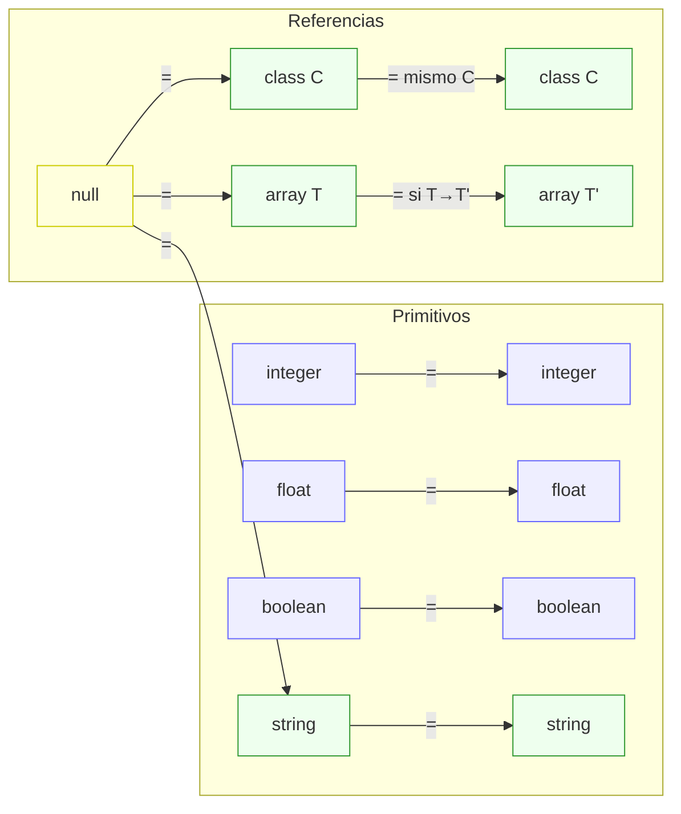
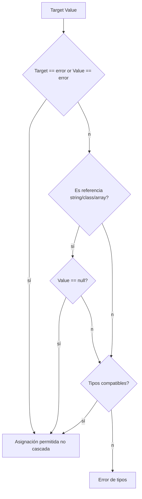

# Semántica de Tipos en Compiscript

## 1. Dominio de tipos

### 1.1 Primitivos

* `integer`
* `float`
* `boolean`
* `string`

### 1.2 Compuestos / referencia

* `array<T>` (arreglos anidados permitidos: `array<array<T>>` equivale a `T[][]`)
* `class <C>` (tipo de referencia a instancia)
* `null` (constante nula, solo asignable a **tipos de referencia**)
* `void` (solo para **tipos de retorno** y posiciones donde no se produce valor)

### 1.3 Sentinela

* `error` (tipo interno para evitar “cascada” de errores: si algo falla, se propaga como `error` y se sigue analizando el resto del programa)

## 2. Tamaños y categoría de almacenamiento

> Estos tamaños son **lógicos** y sirven para RA (*stack frame*) y razonamiento posterior (TAC/backend). Pueden ajustarse si el backend lo requiere.

| Tipo                      | Categoría      | Tamaño lógico |
| ------------------------- | -------------- | ------------- |
| `integer`                 | valor          | 4 bytes       |
| `float`                   | valor          | 8 bytes       |
| `boolean`                 | valor          | 1 byte        |
| `string`                  | **referencia** | 8 bytes       |
| `class <C>`               | **referencia** | 8 bytes       |
| `array<T>`                | **referencia** | 8 bytes       |
| `void` / `null` / `error` | n/a            | 0 (no almac.) |

Notas:

* `string`, `class` y `array<T>` se tratan como **referencias** (punteros/handles).
* El tamaño de `boolean` se normaliza a 1 byte a nivel lógico; la **alineación real** queda a criterio del backend.

## 3. Reglas de *asignabilidad* (`isAssignable(Target ← Value)`)

La asignación es **direccional** (no simétrica). Reglas vigentes:

1. **No cascada:**
   Si `Target` **o** `Value` son `error`, la asignación se considera **permitida** para poder seguir validando el resto del programa.

2. **Igualdad en primitivos:**
   `integer ← integer`, `float ← float`, `boolean ← boolean`, `string ← string` → **válido**
   Combinaciones cruzadas entre primitivos **no** se permiten (p. ej., `integer ← float` es inválido).

3. **Nulabilidad en referencias:**
   `string ← null`, `class<C> ← null`, `array<T> ← null` → **válido**.
   `integer ← null`, `boolean ← null`, etc. → **inválido**.

4. **Clases:**
   `class<A> ← class<B>` solo si **A = B**.
   (No hay subtipado por herencia en asignación; el *downcast* implícito no está permitido.)

5. **Arreglos:**
   `array<T₁> ← array<T₂>` solo si **`T₁ ← T₂`** (regla recursiva por elemento).
   Ej.: `int[][] ← int[][]` ✓ ; `int[] ← float[]` ✗ ; `A[] ← B[]` ✗ salvo `A = B`.

6. **Void:**
   `void` no puede usarse como tipo de variable/expresión; solo es válido en **retornos** de funciones/procedimientos.

### Diagrama (Mermaid) — vista simplificada



## 4. Resultado de operadores

### 4.1 Aritméticos: `+ - * /`

Operandos **numéricos** únicamente.

| LHS \ RHS | integer | float |
| --------- | ------- | ----- |
| integer   | integer | float |
| float     | float   | float |

* `integer op integer → integer`
* `integer op float → float` (promoción)
* `float op integer → float` (promoción)
* `float op float → float`
* Cualquier otra combinación (con `boolean`, `string`, `class`, `array`, etc.) → **error de tipos**.

### 4.2 Concatenación de cadenas

* Permitido únicamente: `string + string → string`.
* **No** hay conversión implícita numérica→string en `+`.

### 4.3 Comparaciones: `== != < <= > >=`

* Requieren **operandos tipos compatibles** (misma regla que para asignabilidad, pero **sin** `null` libre a primitivos).

  * Numéricos comparan con su promoción habitual (si mezcla `int/float`, el check de compatibilidad entra por “compatible numérico” → resultado `boolean`).
  * `string` solo contra `string`.
  * `class<A>` solo contra `class<A>` o `null` (para igualdad/desigualdad).
  * `array<T>` solo contra `null` (para igualdad/desigualdad); no se define orden `<, >` para arreglos.
* Resultado siempre: `boolean`.

> Recomendación: Usa “compatibles” como “misma familia con interpretación clara”. Cuando el código no define explícitamente la promoción, se prefiere **rechazar** en semántica para evitar ambigüedades.

### 4.4 Lógicos: `&& || !`

* Operan únicamente sobre `boolean`.
* Resultado: `boolean`.

## 5. Tipo de expresiones típicas (tabla-resumen)

| Expresión                 | Requisito de operandos                                   | Tipo resultante    |           |           |
| ------------------------- | -------------------------------------------------------- | ------------------ | --------- | --------- |
| `a + b` (numérico)        | `int/float`                                              | promoción numérica |           |           |
| `a - b`, `a * b`, `a / b` | `int/float`                                              | promoción numérica |           |           |
| `s1 + s2` (string)        | `string + string`                                        | `string`           |           |           |
| `a < b`, `a >= b`, etc.   | numéricos compatibles / strings iguales / clases iguales | `boolean`          |           |           |
| `a == b`, `a != b`        | tipos compatibles (incluye `ref == null`)                | `boolean`          |           |           |
| `e && f`, `e              |                                                          | f`                 | `boolean` | `boolean` |
| `!e`                      | `boolean`                                                | `boolean`          |           |           |

## 6. Arreglos (arrays)

### 6.1 Construcción y anidamiento

* `T[]` ≡ `array<T>`.
* `T[][]` ≡ `array<array<T>>`.
* Literales deben ser **homogéneos** (p. ej., `[1, 2, 3] : int[]`).

### 6.2 Asignabilidad de arreglos

* `array<T₁> ← array<T₂>` **solo** si `T₁ ← T₂` (recursivo).
* `null` es asignable a **cualquier** `array<T>`.

### 6.3 Índices y acceso (visión semántica)

* El índice de `a[i]` debe ser `integer`.
* El tipo de `a[i]` es **el tipo de elemento** de `a`.

  * Si `a: int[][]`, entonces `a[i]: int[]` y `a[i][j]: int`.

## 7. Clases

* `class<A>` se trata como **referencia** (8 bytes).
* Asignabilidad: **solo por igualdad** (no hay subtipado por herencia en la fase semántica).

  * `class<A> ← class<A>` ✓
  * `class<A> ← class<B>` ✗
  * `class<A> ← null` ✓
* Comparaciones:

  * `==` / `!=` con la **misma** clase o `null` → **válido** (resultado `boolean`).
  * Orden `<, >` no definido para objetos → **inválido**.

## 8. Nulabilidad

* `null` **solo** para tipos de **referencia**: `string`, `class<C>`, `array<T>`.
* No se permite `integer ← null`, `boolean ← null`, etc.

### Diagrama (Mermaid) — flujo de chequeo básico



## 9. Ejemplos canónicos

### 9.1 Aritmética con promoción

```c
let a: integer = 4;
let b: float   = 1.5;
let c: float   = a + b;   // válido: integer + float -> float
let d: integer = a + b;   // inválido (float -> integer implícito no permitido)
```

### 9.2 Cadenas

```c
let s: string = "hi";
let t: string = " there";
let u: string = s + t;    // válido
let v: string = s + 1;    // inválido: no hay coersión implícita a string
```

### 9.3 Nulabilidad y clases

```c
class A { }
class B : A { }

let p: A = null;          // válido
let q: B = null;          // válido
let r: A = new A();
let s: B = new B();
r = s;                    // inválido (no subtipado a nivel semántico)
```

### 9.4 Arreglos

```c
let xs: integer[]   = [1,2,3]; // ok
let ys: float[]     = [1.0, 2.0];
xs = ys;                       // inválido: int[] <- float[]
xs = null;                     // válido (referencia)
let m: integer[][]  = [[1,2],[3,4]];
let row: integer[]  = m[0];    // ok
```

## 10. Errores frecuentes que reporta la semántica

* **Asignación incompatible**: `cannot assign <T_value> to <T_target>`.
* **Uso de `null` en tipo valor**: “`null` no es asignable a `integer/boolean/...`”.
* **Operación con tipos no numéricos**: p. ej., `a - b` donde `a` o `b` no son `int/float`.
* **Lógicos sobre no-booleanos**: `x && y` si `x` o `y` no es `boolean`.
* **Comparación de no compatibles**: `string < integer`, `class<A> == class<B>`, `array<T> < array<T>`.
* **Índice no entero** en arreglos.
* **Tipo no permitido** en parámetro/variable (p. ej., `void`).
