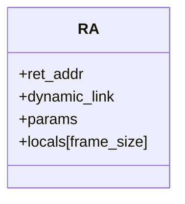
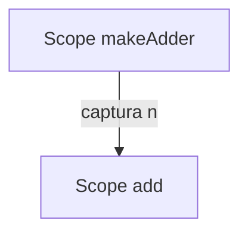
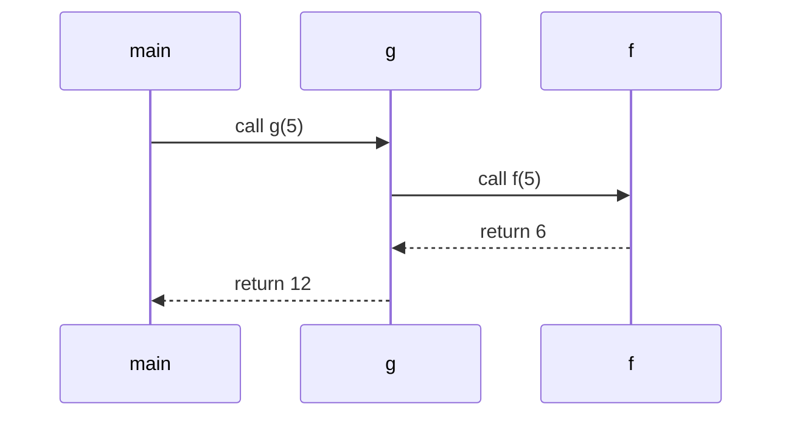

# Semántica de Funciones en Compiscript

Ciclo de vida de una función: **declaración**, **scope**, **parámetros**, **verificación de retorno**, **recursión** y **capturas**.

## 1. Declaración de funciones

Cuando el analizador semántico encuentra una **definición de función**:

1. Se crea un **símbolo de función** en la **tabla de símbolos global** o en la clase correspondiente.
2. Se asocia con:

   * Nombre (`f` o `Clase.método`).
   * **Tipos de parámetros** (`param_types`).
   * **Tipo de retorno** (`return_type`).
   * **Local frame size** (determinado al cerrar el scope).
3. Se valida que **no exista duplicación** en el mismo ámbito:

   * En el mismo scope no puede haber dos funciones con el mismo nombre.
   * Se permite shadowing en scopes internos.

**Ejemplo válido:**

```c
function f(a: int, b: int): int {
  return a + b;
}
```

**Ejemplo inválido (duplicado):**

```c
function f(): int {}
function f(): int {}   // error: redeclaración
```

## 2. Scopes en funciones

Cada función abre un **scope propio**, gestionado por `ScopeManager`:

* Los **parámetros** se insertan como símbolos de almacenamiento `param`.
* Las **variables locales** se insertan como símbolos `stack`.
* Al cerrar el cuerpo de la función:

  * Se calcula el **frame size** (suma de anchos de locales + padding).
  * Se guarda en el símbolo de función para uso posterior (p. ej., generación TAC).

### Diagrama de pila (función simple)



**Ejemplo:**

```c
function g(x: int): int {
  let y: int = x + 1;
  return y;
}
```

* **Params:** `x`
* **Locals:** `y`
* **Frame size:** tamaño(`y`) = 4 bytes

## 3. Parámetros

### 3.1 Reglas

* Los parámetros se verifican **en orden posicional**: número y tipo deben coincidir.
* No se permite repetir nombre de parámetro en la misma función.
* Los parámetros se insertan en el **scope de la función** antes de recorrer el cuerpo.

### 3.2 Ejemplo válido

```c
function add(a: int, b: int): int { return a + b; }
let x: int = add(3, 4); // ✓
```

### 3.3 Ejemplo inválido

```c
function add(a: int, b: int): int { return a + b; }
let y: int = add(3);    // ✗ número de argumentos incorrecto
```

## 4. Verificación de retorno

El módulo `returns.py` asegura que:

* Cada camino de ejecución en una función **no-void** termina en un `return` con valor del tipo correcto.
* Las funciones `void` pueden:

  * Tener `return;` explícito.
  * O terminar el cuerpo sin `return`.

### Ejemplo válido

```c
function max(a: int, b: int): int {
  if (a > b) return a;
  return b;
}
```

### Ejemplo inválido

```c
function h(x: int): int {
  if (x > 0) return x;
  // falta return en la otra rama
}
```

## 5. Recursión

Las funciones pueden **llamarse a sí mismas** porque:

* Su símbolo se inserta en la **tabla de símbolos global** antes de validar el cuerpo.
* El analizador permite que dentro del cuerpo se resuelva el mismo identificador.

### Ejemplo factorial

```c
function fact(n: int): int {
  if (n <= 1) return 1;
  return n * fact(n - 1); // válida
}
```

## 6. Funciones anidadas y capturas (closures)

Cuando una función se define **dentro de otra**:

1. Se crea un símbolo en el **scope interno**.
2. Las referencias a variables externas son **capturadas**:

   * Se genera un `captures_layout` con las variables externas usadas.
   * En TAC, se modela como un `env` asociado al closure (`mkenv`, `mkclos`).

### Ejemplo

```c
function makeAdder(n: int) {
  function add(x: int): int { return x + n; }
  return add;
}
```

* `add` **captura** `n` del scope externo.
* La semántica marca esa captura en el `closure_model.py`.

### Diagrama de entornos



## 7. Ejemplos de pila de llamadas

### Ejemplo: función con llamada a otra

```c
function f(a: int): int {
  return a + 1;
}

function g(b: int): int {
  return f(b) * 2;
}
```

**Ejecución `g(5)`**

1. Se crea RA para `g` con `b=5`.
2. Llama a `f(5)`: se crea RA para `f` con `a=5`.
3. `f` retorna `6`.
4. `g` multiplica `6 * 2` y retorna `12`.

### Diagrama


