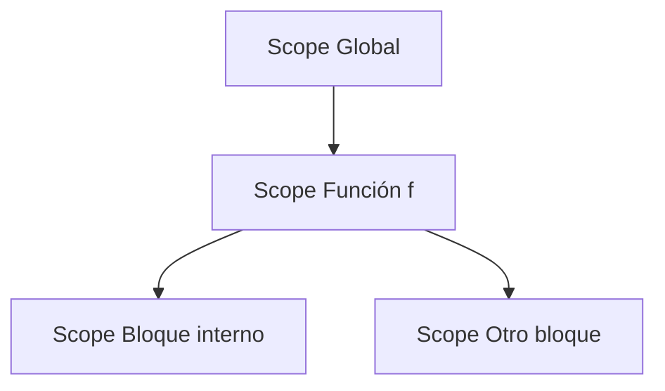
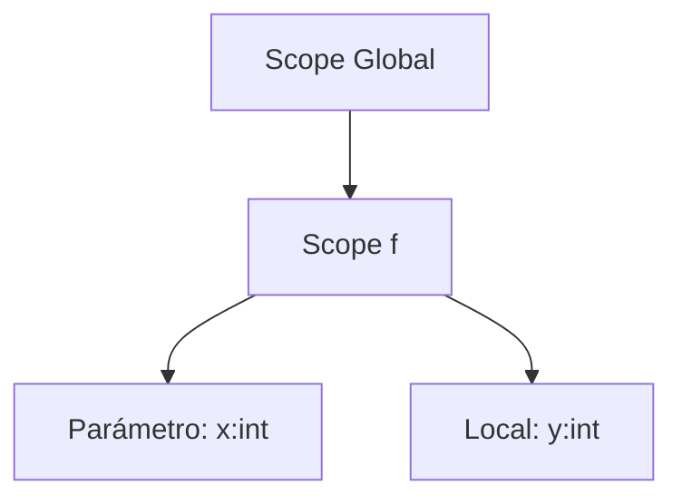
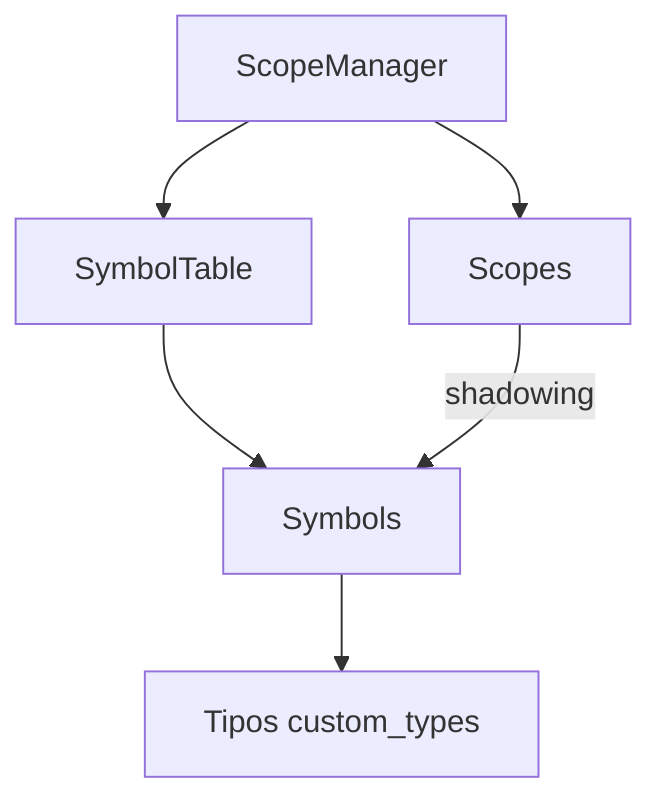

# Semántica de Ámbitos y Símbolos en Compiscript

Cómo se crean y cierran **ámbitos**, qué guarda cada **símbolo**, políticas de **redeclaración** y **shadowing**, y ejemplos con **bloques anidados**.

## 1. Creación y cierre de ámbitos

El compilador administra los **ámbitos (scopes)** como una **pila**:

* **Global**: raíz, donde se insertan funciones, clases y variables globales.
* **Función**: cada función abre un nuevo ámbito con sus parámetros y locales.
* **Clase**: abre un ámbito que contiene atributos y métodos.
* **Bloques** (`{ ... }`): cada bloque crea un scope temporal para variables locales.

### Operaciones principales (`ScopeManager`)

* `enterScope(kind)` → empuja un nuevo ámbito a la pila.
* `exitScope()` → cierra el ámbito actual y devuelve al anterior.
* `currentScope()` → referencia al ámbito activo.



**Ejemplo:**

```c
let a: int = 1;
{
  let b: int = 2;
  {
    let c: int = a + b;
  }
}
```

Ámbitos creados:

1. Global → `a`
2. Bloque externo → `b`
3. Bloque interno → `c`

## 2. Contenido de cada símbolo

Cada símbolo en la **tabla de símbolos** (`symbol_table.py`) guarda:

* **Nombre**: identificador visible.
* **Categoría** (`SymbolCategory` en `symbol_kinds.py`):

  * `variable`
  * `param`
  * `function`
  * `class`
  * `field`
  * `const`
* **Tipo**: referencia a `custom_types.py` (`IntegerType`, `ArrayType`, `ClassType`, etc.).
* **Storage**:

  * `global` (variables globales).
  * `param` (parámetros de función).
  * `stack` (locales dentro de un RA).
* **Offset / frame index**:

  * Posición en el RA de función o en estructura de clase.
* **Width (size)**:

  * Tamaño en bytes, derivado de `type_system.py`.

### Ejemplo de símbolo en RA de función

```json
{
  "name": "x",
  "category": "param",
  "type": "int",
  "storage": "param",
  "offset": 0,
  "width": 4
}
```

## 3. Políticas de redeclaración

* **Prohibido**: redeclarar un símbolo con el mismo nombre en el **mismo scope**.
  Ejemplo inválido:

  ```c
  let x: int = 1;
  let x: int = 2; // error
  ```

* **Permitido (shadowing)**: redeclarar en **un scope interno**.
  Ejemplo válido:

  ```c
  let x: int = 1;
  {
    let x: int = 2; // sombra del externo
  }
  ```

## 4. Shadowing y resolución de nombres

El **resolutor de identificadores** (`identifier.py`) busca en la pila de scopes **de adentro hacia afuera**:

1. Si encuentra el nombre en el scope actual → usa ese símbolo.
2. Si no, sube al scope inmediatamente exterior.
3. Si llega al global y no encuentra → error: *variable no declarada*.

### Ejemplo con bloques anidados

```c
let a: int = 1;
{
  let a: int = 2; // sombra
  let b: int = a; // usa el interno
}
let c: int = a;   // usa el global
```

**TAC conceptual:**

```bash
a   = 1
a#1 = 2   ; variable distinta en otro offset
b   = a#1
c   = a   ; vuelve al externo
```

## 5. Ejemplo con funciones y parámetros

```c
function f(x: int): int {
  let y: int = x + 1;
  return y;
}
```

* Scope global: símbolo `f`.
* Scope de `f`:

  * Parámetro `x` (`storage = param`, `offset = 0`).
  * Local `y` (`storage = stack`, `offset = 4`).

### Diagrama de pila de scopes



## 6. Ejemplo con clases y métodos

```c
class Point {
  x: int;
  y: int;
  move(dx: int, dy: int): void {
    this.x = this.x + dx;
    this.y = this.y + dy;
  }
}
```

* Scope global: símbolo `Point`.
* Scope clase: `x`, `y` como **fields**.
* Scope método `move`:

  * Parámetro implícito `this: Point`.
  * Parámetros `dx`, `dy`.
  * Acceso a `this.x`, `this.y` validado por `class_handler.py`.

## 7. Relación Scopes ↔ Tabla de Símbolos

* **Tabla de símbolos** → contiene todos los símbolos de cada scope.
* **ScopeManager** → administra el ciclo de vida de scopes y maneja shadowing.
* **Identifier resolver** → consulta la pila de scopes para encontrar símbolos válidos.
* **Type system** → asigna tamaño y valida compatibilidad de símbolos.

### Diagrama


