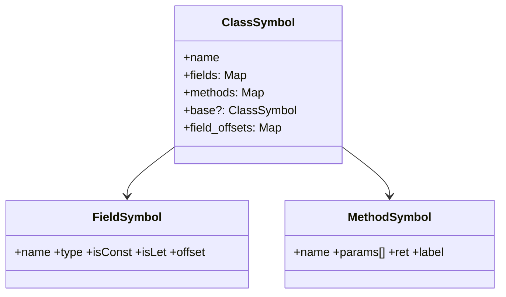
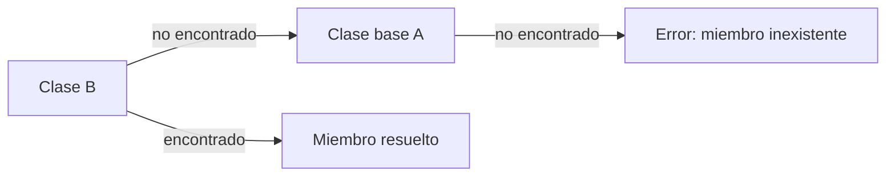
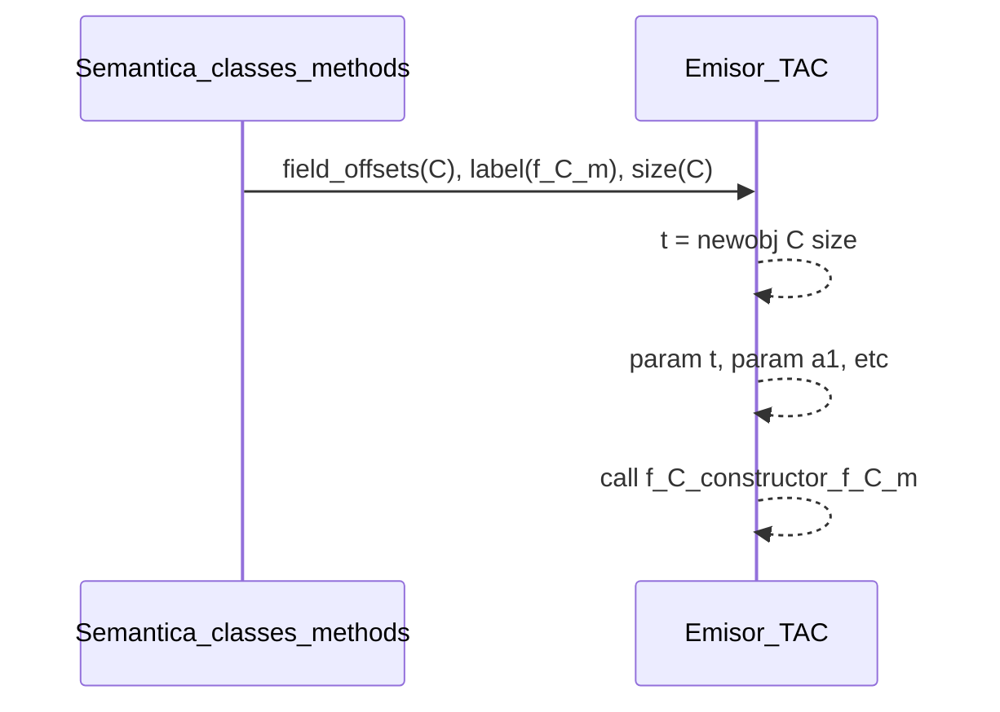

# Semántica de **Clases y Objetos** en Compiscript

## 1. Alcance del módulo semántico

Esta capa valida todo lo relacionado con **declaración y uso de clases**, **acceso a miembros**, **llamadas a métodos/constructores** y **herencia**. Trabaja junto a:

* `class_handler.py` → registro de clases, consolidación de campos, cálculo de offsets lógicos.
* `method_registry.py` → catálogo de métodos por clase, firmas y *override*.
* `type_system.py` / `custom_types.py` → tipos (`ClassType`, `ArrayType`, etc.), reglas de asignabilidad.
* `lvalues.py` / `expressions.py` → chequeos de lectura/escritura a campos e indexados.
* `scope_manager.py` / `symbol_table.py` → *scopes* para clase y para cada método/constructor.

> Objetivo: garantizar que **cada acceso a `obj.f` y cada llamada `obj.m(...)`** tenga un **símbolo válido**, un **tipo consistente** y una **etiqueta de destino** resoluble por el backend TAC.

## 2. Declaración de clases y registro de miembros

### 2.1 Miembros admitidos

* **Campos**: `var` (mutables) y `let` (inicialización obligatoria, luego no re-asignables) y **`const`** (requieren inicializador constante).
* **Métodos**: funciones con primer parámetro implícito `this: ClassType(C)`.
* **Constructor**: `function constructor(...): void`.

### 2.2 Reglas de validez

* **Unicidad de nombres** dentro de la clase: no se permiten dos miembros con el mismo identificador.
* **Inicialización**:

  * `let`/`const` dentro de clase deben quedar **definidos** ya sea en el **cuerpo del constructor** o por **inicializador** de campo.
  * `const` no puede ser redefinida ni modificada luego.
* **Tipos de campo**: deben ser tipos del sistema (`integer`, `boolean`, `string`, `ArrayType(T)`, `ClassType(K)`, …).

### 2.3 Símbolos de clase

Para cada campo/método se guarda:

* **name**, **kind** (`field`/`method`/`const`), **type**.
* **offset lógico** de campo (`field_offsets`) para el futuro direccionamiento (base+desplazamiento) en el backend.
* **firma** del método (parámetros tipados, retorno).



## 3. Herencia y *lookup* de miembros

### 3.1 Búsqueda (regla de *lookup*)

1. Buscar en la **clase actual**.
2. Si no se encuentra, buscar **recursivamente en la base** (`extends`).
3. Si no existe en toda la cadena → **error: miembro no declarado**.

### 3.2 *Override* de métodos

* Permitido si la **firma coincide** (mismo número y tipos de parámetros y mismo tipo de retorno).
* No se permite **cambiar el tipo de retorno** ni **relajar** restricciones de tipos.
* El registro de métodos marca el *override* para que el **despacho estático** en TAC use la etiqueta del método de la clase derivada cuando el tipo del receptor es concreto.



## 4. `this` y *scopes* de método/constructor

* `this` existe **solo** dentro de **métodos** y **constructores**.
* Usar `this` fuera del contexto de clase → **error semántico**.
* En el *scope* de un método:

  * `this: ClassType(C)`
  * parámetros formales
  * variables locales

**Accesos válidos**:

* Lectura: `t = this.f` → tipo `type(f)`
* Escritura: `this.f = expr` → `type(expr)` debe ser **asignable** a `type(f)`.

## 5. Contratos de constructor

* Si la clase **no** declara constructor → existe un **constructor implícito vacío** (sin parámetros).
* Si declara constructor:

  * **Aridad y tipos** de argumentos en `new C(args...)` deben coincidir con la firma.
  * Dentro del constructor, deben satisfacerse las **inicializaciones** necesarias (p. ej. `let`/`const` de campos).
* **`this`** es el **primer parámetro implícito** del constructor.

**Errores típicos**:

* Llamar `new C(a,b)` con número/tipo de argumentos incorrectos.
* No inicializar campos `let`/`const` que lo requieren.

## 6. Accesos a miembros: lectura/escritura y validaciones

### 6.1 Acceso a campo

* **Lectura**: `x = obj.f;` — `obj` debe ser de tipo **clase** con un campo `f`.
* **Escritura**: `obj.f = e;` — `type(e)` debe ser **asignable** a `type(f)`; si `f` es `const` o `let` ya inicializado → **error**.

### 6.2 Indexación en campos *array*

* `obj.f[i]` solo si `f` es `ArrayType(T)` y `i: integer`.
* Indexar un campo **no-array** → **error**.
* Si la variable receptora es `const` (p. ej., `const a: int[]`), **cualquier mutación** como `a[i] = ...` es **inválida** (la ligadura es inmutable).

### 6.3 Encadenamientos

* `a.b.c[1]` es válido si cada paso resuelve a tipos correctos:

  * `a: ClassType(A)` con campo `b: ClassType(B)`
  * `B` tiene `c: ArrayType(T)`
  * `1: integer`

## 7. Relación con **TAC**

La fase semántica **prepara toda la información** que el generador TAC necesita:

* **`field_offsets`**: permite traducir `obj.f` a **carga/almacén de campo abstracto**; el backend lo expandirá a `base + offset(f)`.
* **Etiquetas de métodos** (`f_<Clase>_<método>`) y **firma**: habilitan `param this; param a1; ...; call f_..., n+1`.
* **Constructor**: `newobj C, size(C)` + `call f_C_constructor, ...` solo si la semántica confirmó su existencia/compatibilidad.
* **Tipos resueltos**: garantizan que `obj.f = expr` y `obj.m(args)` sean **bien tipados**, evitando emitir TAC inválido.
* **Reglas de `this`**: aseguran que toda referencia a `this` en TAC provenga de un *scope* válido (método/ctor).



## 8. Errores semánticos comunes (detectados)

* **Miembro inexistente**: `obj.z` donde `z` no está en la clase ni en su base.
* **Indexación inválida**: `obj.f[i]` cuando `f` no es arreglo, o `i` no es `integer`.
* **Mutación de `const`**: `a[0] = ...` si `a` es `const`.
* **Uso de `this` fuera de clase**.
* **Llamada a constructor/método con aridad/tipos incorrectos**.
* **Override incompatible** (firma distinta).

## 9. Ejemplos rápidos

**Declaración y uso básico:**

```c
class Box {
  var data: integer[];
  function constructor(n: integer): void { this.data = [0,0,0,0]; }
  function put(i: integer, v: integer): void { this.data[i] = v; }
  function get(i: integer): integer { return this.data[i]; }
}
let b: Box = new Box(4);
b.put(2, 99);
let q: integer = b.get(2);
```

**Herencia con `override`**

```c
class A { let x: integer; function constructor(x: integer){ this.x = x; } function get(): integer { return this.x; } }
class B : A { function get(): integer { return this.x + 1; } } // override válido

let a: A = new A(3);
let b: B = new B(4);
let r1: integer = a.get();
let r2: integer = b.get();
```

**Errores capturados:**

```c
class C { var x: integer; function constructor(){ this.x = 0; } }
let c: C = new C();
c.x[0] = 1;        // ❌ indexar campo no-arreglo
let y: integer = 0;
y.data[0] = 1;     // ❌ miembro sobre no-objeto
const a: integer[] = [1];
a[0] = 2;          // ❌ mutación sobre const
```
