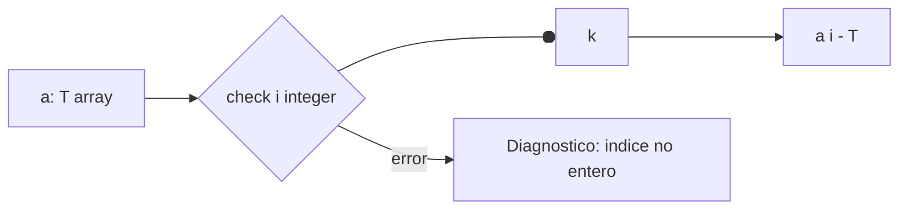
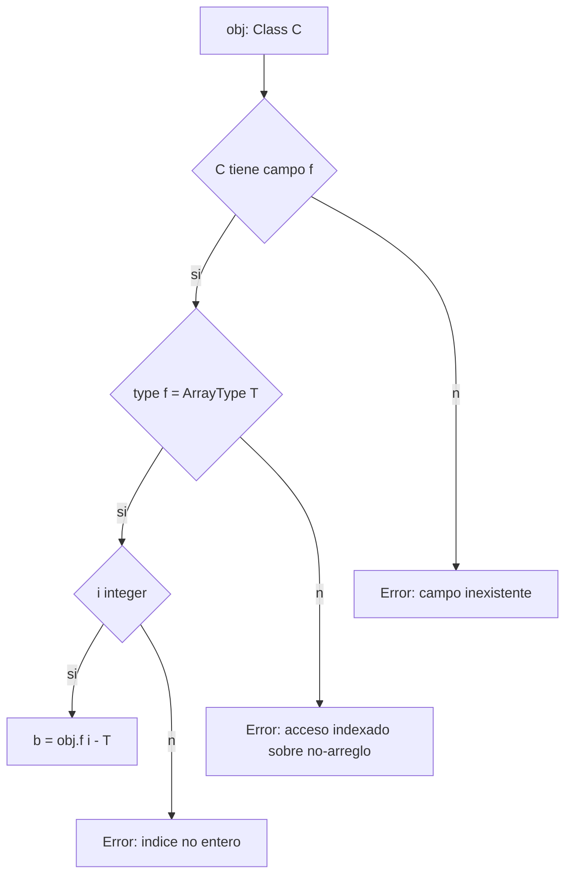

# Semántica de **Listas/Arreglos** en Compiscript

## 1. Modelo de tipos y creación de arreglos

* El tipo de un arreglo se modela como **`ArrayType(T)`** donde `T` es el **tipo exacto** de sus elementos (por ejemplo, `integer[]`, `boolean[]`, `ClassType(Box)[]`, `integer[][]`, etc.).
* Los **literales de lista** (`[e1, e2, ..., en]`) se tipan por **homogeneidad**:

  * Todas las expresiones `ek` deben ser **compatibles** con un **mismo tipo base `T`**; el literal se anota como `ArrayType(T)`.
  * Si cualquier `ek` no es compatible con `T` → **error semántico** (literal heterogéneo).
* Arreglos multidimensionales se encadenan:
  `[[1,2],[3,4]] : integer[][]`

> **Decisión:** No hay arreglos “mixtos” ni *auto-casts* implícitos que cambien `T` del literal; la homogeneidad la decide el sistema de tipos, no el emisor de TAC.

## 2. Índices: tipo y validez contextual

* Toda indexación `a[i]` exige **`i: integer`**.
* Indexar con `boolean`, `string`, `float`, funciones, objetos, etc. → **error de tipo**.
* “Indexación encadenada” respeta el tipo del paso previo:
  si `a: integer[][]`, entonces `a[i] : integer[]` y `a[i][j] : integer`.



## 3. Lectura y escritura sobre arreglos

### 3.1 Lectura

* Si `a: ArrayType(T)` y `i: integer`, entonces **`a[i]: T`**.
* La lectura **no** cambia el tipo ni el estado del arreglo.

### 3.2 Escritura

* En `a[i] = v`, si `a: ArrayType(T)` y `i: integer`, entonces se exige **`v ⪯ T`** (*`v` asignable a `T`*).
* **Constantes y `let`**:

  * Si `a` fue declarado **`const`**, **no se permite** ninguna escritura `a[i] = ...` (la referencia es inmutable).
  * Si `a` es **`let`** (constante una vez inicializada), la **ligadura** no cambia (no puede reasignarse `a = otroArreglo`), pero **sí** puede mutarse su contenido **solo si** la semántica del proyecto define `let` como “valor inmutable, contenido mutable”; si `let` también congela el contenido (variante más estricta), la escritura es error.

    > En los tests del repositorio, el caso prohibido explícito es **mutar `const`**.

## 4. Asignabilidad entre arreglos

* **Invariante por elemento**: `ArrayType(T1)` **no** es asignable a `ArrayType(T2)` salvo que **`T1 == T2`** (mismo tipo exacto).

  * Ejemplo: `integer[]` **no** se puede asignar a `float[]`, ni `B[]` a `A[]` (aunque `B <: A`) — sin conversión explícita/soporte de covarianza.
* **Compatibilidad exacta**:

  * `x: integer[]; y: integer[]; x = y;` ✔️
  * `x: integer[][]; y: integer[][]; x = y;` ✔️ solo si las **dimensiones** y **tipos base** coinciden.

> **Razón:** evitar aliasing peligroso y mantener la comprobación de tipos simple y determinista.

## 5. Composición con clases y campos de tipo lista

* Si `class Box { var data: integer[]; }` entonces:

  * `b.data : integer[]`
  * `b.data[i] : integer`
  * Se aplican **todas** las reglas anteriores: índice entero y compatibilidad de asignación en `b.data[i] = v`.
* **Encadenamientos** del estilo `obj.f[i].g[j]` son válidos únicamente si:

  1. `f` existe y es `ArrayType(T)`,
  2. `i: integer`,
  3. `T` es una clase con campo `g: ArrayType(U)`,
  4. `j: integer`.



## 6. Ejemplos correctos

```c
// Literales homogéneos
let xs: integer[]  = [1, 2, 3];
let m:  integer[][] = [[1,2], [3,4]];

// Lectura y escritura compatibles
let i: integer = 1;
let v: integer = xs[i];
xs[i] = v + 5;

// Campo arreglo en clase
class Box {
  var data: integer[];
  function constructor(): void { this.data = [7,8,9]; }
  function get(i: integer): integer { return this.data[i]; }
  function put(i: integer, x: integer): void { this.data[i] = x; }
}
let b: Box = new Box();
let z: integer = b.get(1);
b.put(2, 99);

// Multidimensional
let row: integer[] = m[1];
```

## 7. Ejemplos de errores

| Código                                        | Motivo                        | Diagnóstico esperado                                             |
| --------------------------------------------- | ----------------------------- | ---------------------------------------------------------------- |
| `a[true] = 1;`                                | Índice no entero              | “Índice no entero en asignación de arreglo: se encontró `bool`.” |
| `a[0] = "hi";`                                | Tipo incompatible de elemento | “Asignación incompatible: `string` → `integer` en `a[i]`.”       |
| `c.x[0] = 1;` cuando `x: integer`             | Indexación sobre no-arreglo   | “Asignación indexada sobre un no-arreglo: `c.x` es `integer`.”   |
| `y.data[0] = 1;` cuando `y: integer`          | Acceso a miembro en no-objeto | “Asignación indexada a propiedad en no-objeto: `integer`.”       |
| `const a: integer[] = [1]; a[0] = 2;`         | Mutación de constante         | “No se puede modificar la constante `a`.”                        |
| `a: integer[] = [1, true];`                   | Literal heterogéneo           | “Literal de arreglo no homogéneo: `integer` vs `boolean`.”       |
| `let b: boolean[] = [true, false]; b[0] = 1;` | Valor no asignable            | “Asignación incompatible: `integer` → `boolean` en `b[i]`.”      |

> Los mensajes exactos pueden variar según `diagnostics.py`, pero la **causa** y el **punto** del error deben coincidir.

## 8. Reglas prácticas de chequeo

1. **Tipado de literal**:

   * Infiera `T` de los elementos.
   * Verifique que **todos** `ek` son asignables a `T`.
   * Anote el literal como `ArrayType(T)`.

2. **Indexación** `E ≡ A[I]`:

   * Tipar `A` y exigir `A : ArrayType(T)`.
   * Exigir `I : integer`.
   * Resultado: `E : T`.

3. **Escritura indexada** `A[I] = V`:

   * Tipar `A : ArrayType(T)` y `I : integer`.
   * Exigir `V ⪯ T`.
   * Si `A` es `const`, **rechazar**.

4. **Asignación de arreglos** `L = R`:

   * Requiere **igualdad exacta** de tipos `ArrayType(T)` ↔ `ArrayType(T)` (misma dimensión y `T`).
   * No hay covarianza/contravarianza por defecto.

5. **Campos arreglo** `obj.f[ ... ]`:

   * Resolver `obj.f`.
   * Exigir que su tipo sea `ArrayType(T)` antes de permitir `[...]`.

## 9. Casos de prueba recomendados (plantillas)

* **Índice no entero**:

  ```c
  function main(): void {
    let a: integer[] = [1,2];
    a[true] = 1; // ❌
  }
  ```

* **Tipo incompatible en escritura**:

  ```c
  function main(): void {
    let a: integer[] = [1,2];
    a[0] = "hi"; // ❌
  }
  ```

* **Indexación sobre no-arreglo**:

  ```c
  class C { var x: integer; function constructor(){ this.x = 0; } }
  function main(): void {
    let c: C = new C();
    c.x[0] = 1; // ❌
  }
  ```

* **Mutación de `const`**:

  ```c
  function main(): void {
    const a: integer[] = [1];
    a[0] = 2; // ❌
  }
  ```

* **Composición con campo arreglo**:

  ```c
  class Box { var data: integer[]; function constructor(){ this.data = [0,1,2]; } }
  function main(): void {
    let b: Box = new Box();
    b.data[1] = 3; // ✔️
  }
  ```
