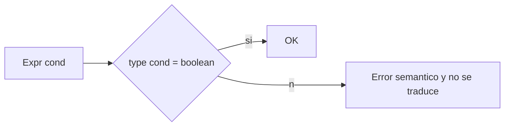
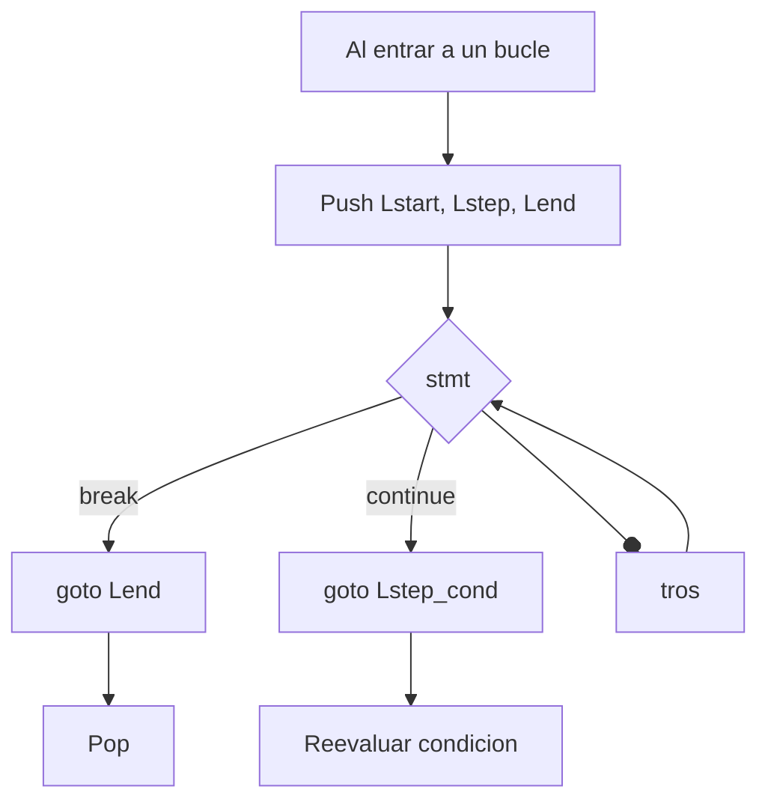
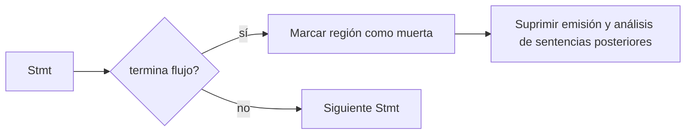

# Semántica de Control de Flujo en Compiscript

## 1. Condiciones booleanas (predicados)

* Toda condición en `if`, `while`, `do-while`, `for`, `switch` (cuando aplica) **debe** tipar a **`boolean`**.
* Operadores lógicos:

  * `&&` y `||` exigen **ambos** operandos `boolean` y respetan **corto-circuito**.
  * `!` invierte un `boolean`.
* Comparaciones (`==`, `!=`, `<`, `<=`, `>`, `>=`) retornan `boolean` y exigen **operandos compatibles** (mismo tipo o regla de compatibilidad del sistema de tipos).

**Diagnósticos típicos:**

* “La condición del `if` debe ser `boolean`”
* “`&&`/`||` requiere operandos `boolean`”
* “Comparación con operandos incompatibles”



## 2. `if` y `if-else`

* Se exige `cond: boolean`.
* Cada rama es un bloque propio; nombres declarados dentro **no** escapan a la rama.
* Es válido que solo una rama haga `return` (ver §5 para funciones no-void).

**Ejemplo correcto:**

```c
if (x < 0 || y > 0) {
  a = 1;
} else {
  a = 2;
}
```

**Errores comunes:**

* Condición no booleana.
* Referenciar variables de una rama fuera de su alcance.

**Implicación TAC:**

* Las condiciones se traducen **con saltos** y etiquetas (corto-circuito) sin materializar booleanos intermedios salvo cuando la expresión se usa como valor (ver documento de TAC).

## 3. Bucles: `while`, `do-while`, `for`

### 3.1 Reglas semánticas comunes

* La **condición** debe ser `boolean`.
* Se crea un **ámbito** interior para el cuerpo.
* Se registran destinos de `break`/`continue` en una **pila** (ver §4).
* Declaraciones en el encabezado del `for` viven en el **ámbito del bucle**.

### 3.2 `while (cond) { ... }`

* Evalúa `cond` antes de entrar al cuerpo.
* `continue` salta a la **reevaluación** de `cond`.

### 3.3 `do { ... } while (cond);`

* Ejecuta el cuerpo **al menos una vez**.
* `continue` salta al punto donde se **vuelve a evaluar** `cond`.

### 3.4 `for (init; cond; step) { ... }`

* `init` se ejecuta una sola vez, luego `cond` por iteración.
* `continue` salta a **`step`** y luego a la reevaluación de `cond`.
* Si `cond` está ausente, se asume **verdadero** (bucle potencialmente infinito).

**Errores comunes:**

* `continue`/`break` fuera de bucle.
* Condición no booleana.
* Declaraciones con el mismo nombre en el mismo ámbito del encabezado.

**Implicación TAC:**

* Estructuras con etiquetas `Lstart`, `Lbody`, `Lstep`, `Lend`.
* `continue` → `Lstep` (en `for`) o `Lstart`/punto de condición (en `while`/`do-while`).
* `break` → `Lend`.

## 4. `break` y `continue`

* **Solo** válidos **dentro de bucles**.
* `break` termina el bucle más interno.
* `continue` pasa a la próxima iteración:

  * `for`: ejecuta `step`, luego reevaluación de `cond`.
  * `while`: salta a reevaluación de `cond`.
  * `do-while`: salta a la evaluación de `cond` al final.

**Diagnósticos:**

* “`break`/`continue` fuera de un bucle”



## 5. `return` (y chequeo de retorno en funciones)

* `return` **solo** puede aparecer **dentro de una función**.
* Funciones **no-void**: cada ruta de ejecución **debe** culminar en `return expr` con tipo **asignable** al **tipo de retorno**.
* Funciones `void`: `return;` opcional; `return expr;` es **error**.

**Diagnósticos:**

* “`return` fuera de función”
* “La función `f: T` debe devolver un `T` en todos los caminos”
* “Tipo devuelto `U` no asignable a `T`”

**Implicación TAC:**

* `return` termina el bloque y **no** se emite nada después (ver §6).

## 6. Terminación de flujo y código muerto

* Cuando un statement **termina el flujo** del bloque (p. ej., `return`, `break` que sale del bucle, `continue` que salta al `step/cond`), cualquier sentencia **posterior** en la misma región inmediata es **código muerto**.
* El analizador semántico marca esa región como **inalcanzable** para:

  * evitar diagnósticos en cascada,
  * impedir **emisión TAC** de instrucciones que nunca ejecutarán,
  * mantener el **IR** y los **logs** consistentes.

**Ejemplo:**

```c
function f(): void {
  return;
  x = 1; // ❌ muerto (no se emite)
}
```



## 7. `switch` (con fall-through controlado)

* La **expresión** de `switch` debe ser **tipable** y comparable con las **constantes** de `case`.
* Un `case` sin `break` **cae** al siguiente (fall-through) de forma intencional.
* `break` sale del `switch`.
* `default` es opcional.

**Errores comunes:**

* Tipos de `case` incompatibles con la expresión de control.
* Uso de `break` fuera de `switch`/bucle.

**Implicación TAC:**

* Cadenas de comparaciones y saltos a etiquetas `Lcase_k`, `Ldef`, `Lend`.
* El **fall-through** se refleja **no** insertando `goto` implícito entre casos.

## 8. Matriz de validez rápida

| Construcción             | Requisito principal            | Ámbito/Contexto              | Errores típicos                        |
| ------------------------ | ------------------------------ | ---------------------------- | -------------------------------------- |
| `if (cond)`              | `cond: boolean`                | Rama crea ámbito             | Condición no booleana                  |
| `while (cond)`           | `cond: boolean`                | Cuerpo crea ámbito           | `continue`/`break` fuera de bucle      |
| `do { } while (cond);`   | `cond: boolean`                | Cuerpo crea ámbito           | Condición no booleana                  |
| `for (init; cond; step)` | `cond: boolean` o ausente      | Ámbito del bucle             | `continue` fuera; colisiones en `init` |
| `switch (E)`             | `E` comparable con `case`      | Cuerpo crea ámbito           | Tipos incompatibles en `case`          |
| `break`                  | —                              | **Dentro** de bucle/`switch` | Fuera de bucle/`switch`                |
| `continue`               | —                              | **Dentro** de bucle          | Fuera de bucle                         |
| `return`                 | Tipo conforme al de la función | **Dentro** de función        | Fuera de función; tipo incompatible    |

## 9. Ejemplos de diagnóstico (del repositorio)

* **Corto-circuito en `if`:**

  ```c
  if ((x < 10) || (x > 20) && (x != y)) { y = 0; } else { y = 1; }
  // ✔ Condición booleana compuesta, respeta corto-circuito
  ```

* **`continue` en bucle `while`:**

  ```c
  while (i < 5) {
    i = i + 1;
    if (i % 2 == 0) { continue; }
    s = s + i;
  }
  // ✔ 'continue' salta a reevaluación de la condición
  ```

* **`do-while`:**

  ```c
  do { i = i - 1; } while (i > 0);
  // ✔ ejecuta una vez antes de verificar
  ```

* **`switch` con fall-through:**

  ```c
  switch (op) {
    case 0: r = 10; break;
    case 1: r = 20; // cae a default
    default: r = r + 1;
  }
  // ✔ fall-through intencional si no hay 'break'
  ```

* **Código muerto tras `return`:**

  ```c
  function f(): void {
    return;
    this.data[0] = 1; // ❌ inalcanzable
  }
  ```
