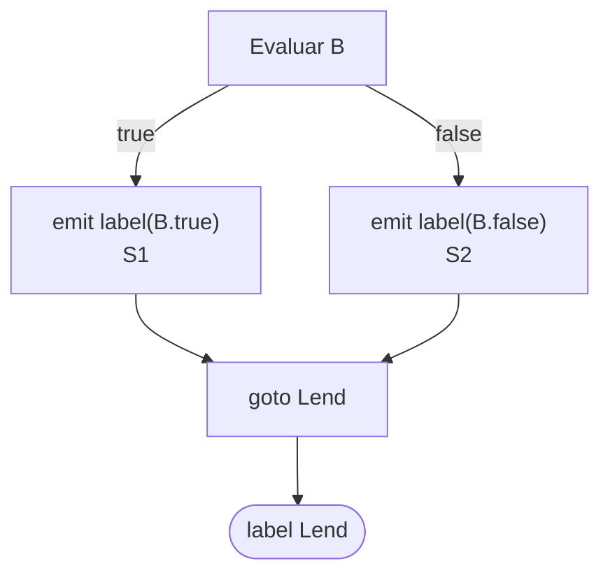
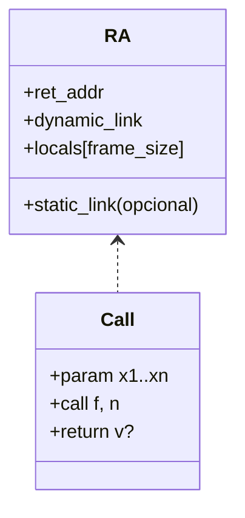

# Diseño de la Fase de Generación de Código Intermedio (TAC)

Este documento estableció el diseño determinista de la fase de **Código Intermedio** para el compilador de Compiscript. Se definió el formato **3AC textual** con **cuádruplos** como representación subyacente, la extensión de la **tabla de símbolos**, el procedimiento de **traducción de expresiones y control de flujo**, el **algoritmo de reciclaje de temporales**, el **modelado de registros de activación**, los cambios requeridos en estructuras existentes y un inventario de construcciones a soportar.

## 1. Formato de TAC

### Decisión

Se definió que el **código intermedio** se representará como:

1. **3AC textual** (fichero `.tac`): una secuencia lineal de instrucciones con **etiquetas simbólicas** (`Lk:`), asignaciones, saltos explícitos, invocaciones y retornos.
   **Justificación:** resulta legible para inspección manual, fácil de versionar y de comparar en pruebas, y sirve como artefacto de salida para `src/logs/out/`.

2. **Cuádruplos**: estructura `(op, arg1, arg2, res)` mantenida en memoria por el emisor para pruebas programáticas y optimizaciones futuras.
   **Justificación:** los cuádruplos mantienen **nombres simbólicos** (incluyendo temporales), resisten reordenamientos y simplifican el mapeo posterior a registros o direcciones. Se evitó el uso de **trípletas** porque referencian posiciones relativas frágiles ante transformaciones, lo que complica tanto el reciclaje de temporales como la refactorización del flujo.

### Conjunto de instrucciones (3AC)

Se modeló el siguiente subconjunto estándar (Aho et al.):

- **Asignaciones y unarias**

  `x = y op z` | `x = op y` | `x = y`

- **Saltos y relacionales**

  `goto L` | `if x goto L` | `ifFalse x goto L` | `if x relop y goto L`

- **Llamadas y retornos**

  `param x` | `call f, n` | `y = call f, n` | `return` | `return y`

- **Indexadas**

  `x = a[i]` | `a[i] = x`

Se acordó que el **3AC textual** incluirá **etiquetas** (`Lk:`) y que cada cuádruplo podrá portar un campo opcional `label` para marcar inicios de bloque básico.

## 2. Extensión de la Tabla de Símbolos

El diseño aprovechó los metadatos existentes (`offset`, `width`, `storage ∈ {global, stack}`, `is_ref`, `scope_id`) para direccionamiento lógico en 3AC y los complementó con campos específicos para TAC y Registros de Activación (RA). La **gestión de scopes** ya calculaba el tamaño de marco (`frameSize()`) al cerrar un ámbito, lo que se reutilizó para RA.

### Nuevos metadatos

- **Variables/constantes/parámetros**

  - `addr_class`: se interpretará a partir de `storage` y se extenderá con el valor `param` para parámetros.
  - `frame_index`: se mantuvo equivalente a `offset` para direccionamiento relativo a FP/SP.
  - `home_fn`: referencia al `scope_id` propietario para apoyar cierres.

- **Funciones y métodos**

  - `label`: etiqueta de entrada (`f_<nombre>` o `f_<Clase>_<método>`), usada por `call`.
  - `local_frame_size`: tamaño del marco local, persistido al cerrar el scope de la función/método.
  - `param_kinds`: lista de modos; se fijó **por valor** en esta fase para un comportamiento determinista.
  - `captures_layout`: orden y tipos de capturas para closures.

- **Clases y campos**

  - `field_offsets`: mapa `campo -> offset` determinado por `ClassHandler` tras registrar atributos, para permitir `obj.f` y `obj.f = v` en 3AC.

**Justificación:** estos metadatos habilitaron un mapeo consistente entre símbolos semánticos y **lugares** del TAC, y un modelado claro del RA independiente de la plataforma de destino.

## 3. Generación de TAC para expresiones y control de flujo

### Modelo de visita

Cada visita de expresión devolvió un registro:

- `ExprRes = { type, place, is_temp }`, donde `place` es una **dirección** en 3AC: un nombre, literal o temporal con $place \in {\text{Id}, \text{Const}, t_i}$.

Las instrucciones de efecto se **emitieron in situ** a través de un **Emitter** con buffer (lista de cuádruplos y acumulador textual). Este enfoque evitó una segunda pasada y aprovechó la información de tipos y ámbitos ya calculada por la fase semántica (`src/semantic/`).

### Algoritmo de temporales (reciclaje)

Se definió un **pool por tipo**: `free_temps['int'|'bool'|'ref'|...]`.

- `newtemp(type)`: entregó un temporal disponible o creó uno nuevo (`t_k`).
- **Liberación:** tras `emit(T = L op R)`, si `L` y/o `R` fueron temporales que no se propagaron como resultado, se retornaron al pool.
- **Regla determinista:** la liberación se efectuó en **post-orden** al emitir la operación del padre, excepto cuando el resultado se devolviera como `place`.
- Se reinicializó el estado de pools al final de **cada sentencia** para evitar fugas de vida de temporales entre sentencias.

**Justificación:** el reciclaje local por sentencia y post-orden minimizó la presión de temporales sin introducir análisis de liveness global en esta fase.

### Esquemas de traducción

#### A. Expresiones aritméticas y relacionales

- **Binaria**

  1. `L <- visit(E1)`
  2. `R <- visit(E2)`
  3. `T <- newtemp(type(E1 op E2))`
  4. `emit(T = L.place op R.place)`
  5. `free(L), free(R)` cuando fuesen temporales
  6. devolver `{type, T, is_temp=True}`

- **Unaria (`-`, `!`)**

  1. `X <- visit(E)`
  2. `T <- newtemp(type(op,E))`
  3. `emit(T = op X.place)`
  4. `free(X)` si temporal
  5. devolver `{type, T, True}`

- **Relacional (`<, <=, >, >=, ==, !=`)**

  - **Como valor** (p. ej., `x = (a<b)`): `T = newtemp(bool)`; `emit(T = (a rel b))`.
  - **Como control**: `emit(if a rel b goto B.true)`; `emit(goto B.false)`.

**Justificación:** se separaron los contextos **de cálculo** y **de control** para permitir **corto-circuito** y evitar temporales booleanos innecesarios, según técnicas DDS.

#### B. Asignaciones

- `LHS <- place(lvalue)` (identificador, `a[i]`, `obj.f`).
- `RHS <- visit(expr)`
- `emit(LHS = RHS.place)`
- `free(RHS)` si temporal.

#### C. Booleanos con corto-circuito

Se emplearon atributos heredados `B.true` y `B.false` (estilo DDS), generando saltos condicionales en lugar de materializar booleanos.

- **`B -> B1 || B2`**
  `B1.true = B.true`; `B1.false = Lmid`; `B2.true = B.true`; `B2.false = B.false`
  Código: `B1.code; label Lmid; B2.code`

- **`B -> B1 && B2`**
  `B1.true = Lmid`; `B1.false = B.false`; `B2.true = B.true`; `B2.false = B.false`
  Código: `B1.code; label Lmid; B2.code`

- **`B -> E1 rel E2`**
  `emit(if E1 rel E2 goto B.true)`; `emit(goto B.false)`

**Diagrama (Mermaid): `if (B) S1 else S2`**



**Justificación:** este esquema consolidó las **reglas DDS** de traducción de booleanos y control de flujo, manteniendo el 3AC compacto y fiel a la semántica (Aho et al., cap. 6; ver también `docs/README_TAC_GENERATION.md`).

#### D. Control de flujo

- **`if (B) S1`**

  ```bash
  B.true = Lthen; B.false = Lend
  B.code
  Lthen: S1.code
  Lend:
  ```

- **`if (B) S1 else S2`**

  ```bash
  B.true = Lthen; B.false = Lelse
  B.code
  Lthen: S1.code; goto Lend
  Lelse: S2.code
  Lend:
  ```

- **`while (B) S`**

  ```bash
  Lstart:
    B.true = Lbody; B.false = Lend
    B.code
  Lbody: S.code; goto Lstart
  Lend:
  ```

**Justificación:** se adoptaron patrones canónicos de bloques con etiquetas para asegurar claridad estructural y facilitar optimizaciones y análisis posteriores (Aho et al., cap. 6; `docs/README_TAC_GENERATION.md`).

#### E. Llamadas y modelo de RA

- **Convención de evaluación:** argumentos de izquierda a derecha.
- Emisión:

  - `param arg_i` por cada argumento
  - `y = call f_label, n` o `call f_label, n` si no hay valor de retorno
  - en la entrada de la función: `enter f_label, local_frame_size` (pseudo-operación informativa)
  - `return` o `return y` al salir del cuerpo

**Esquema de RA:**



**Justificación:** se modeló un RA independiente de la máquina objetivo, suficiente para pruebas y para una generación posterior de código de máquina o de bytecode. La pseudo-instrucción `enter` formalizó el tamaño del marco con datos suministrados por el manejador de scopes.

**Closures:** se definió `closure = mkclos f_label, env` y `t = callc closure, n`, donde `env` encapsula capturas según `captures_layout`. **Justificación:** este patrón explicitó la semántica de entornos y habilitó llamadas con contexto, sin atar el diseño a un runtime específico.

## 4. Validación del código existente y ajustes requeridos

Se verificó que la arquitectura actual permitió **generar TAC en la misma pasada** que la semántica:

- `VisitorCPS` ya orquestaba analizadores por categoría y se estableció como punto de inyección del **Emitter TAC**.
- `Symbol` ya exponía `storage`, `offset`, `width`, `is_ref`, `scope_id`, que se reutilizaron para direccionamiento lógico.
- `ScopeManager` ya calculaba `frameSize()` al cerrar scopes, lo que se persistirá como `local_frame_size` en símbolos de funciones/métodos.
- Los analizadores de **expresiones**, **lvalues**, **control de flujo**, **funciones/métodos** permitieron emitir TAC local por regla, evitando una segunda pasada.

**Ajustes mínimos definidos:**

1. Inyectar un **Emitter** compartido (cuádruplos + 3AC textual) accesible desde `VisitorCPS` y los analizadores.
2. Hacer que las visitas de **expresiones** devuelvan `ExprRes { type, place, is_temp }`.
3. Incorporar generadores `newlabel()` y `newtemp(type)` con **pools por tipo** para reciclaje determinista.
4. Persistir `local_frame_size` en el símbolo de la función/método al salir de su scope.
5. Añadir reportes `write_tac_text` y `write_tac_html` análogos a los de AST/TS en `src/logs/out/`.

## 5. Cambios en la tabla de símbolos

Se definieron los siguientes cambios (sin mostrar código):

- `Symbol.storage`: se mantuvo la semántica actual y se extendió el dominio a `param` para parámetros.
- `Symbol` (funciones): se añadió `label` y `local_frame_size`, persistidos al cerrar el scope.
- `Symbol` (clases/campos): se incorporó `field_offsets` calculado por `ClassHandler` al materializar atributos.
- `Symbol` (funciones con closures): se formalizó `captures_layout` como lista ordenada (nombre, tipo, scope) para construir `env`.
- Se reforzó la normalización de `width` de acuerdo con `type_system` en el alta de símbolos.

**Justificación:** estos cambios estabilizaron el enlazado entre **símbolos semánticos** y **lugares TAC**, y prepararon el modelo para **RA** y **closures**.

## 6. Inventario de construcciones que requirieron generación de TAC

### Expresiones

- **Aritméticas binarias:** $+, -, \times, \div$
- **Aritméticas unarias:** $-$
- **Relacionales:** $<, \le, >, \ge, ==, !=$
- **Lógicas:** `&&`, `||`, `!` con **corto-circuito**
- **Copia:** `x = y`
- **Indexadas:** `x = a[i]`, `a[i] = x`
- **Acceso a propiedad:** `obj.f`, `obj.f = v`
- **`this`** en métodos (primer parámetro implícito)

### Sentencias y estructuras

- **Declaraciones `let/const`** con o sin inicializador (inicialización por defecto a `null` para referencias).
- **Asignación** a simples y compuestos (`a[i]`, `obj.f`).
- **Condicionales:** `if`, `if-else` con corto-circuito.
- **Bucles:** `while`, `do-while`, `for` (estilo C).
- **`switch`:** descompuesto a comparaciones y saltos a `case/default`.
- **`break`/`continue`:** saltos a fin de bucle o reevaluación.
- **Funciones:** `enter f, size`, `return`, tipos y parámetros.
- **Llamadas:** `param`, `call f, n`, `t = call f, n`.
- **`return (expr?)`.**
- **Clases/métodos:** etiquetas cualificadas `Class.method`, manejo de `this`.
- **`new`:** reserva y llamada a `Class.constructor` si existe; por defecto, inicialización de campos.
- **`foreach`** (si figura en la gramática): desazucarado a bucle `for` en esta fase.
- **Closures** (si aparecen): `mkclos f_label, env`, `callc closure, n`.

**Justificación:** el inventario cubrió el conjunto evaluable en la rúbrica de TAC y se alineó con la gramática y las capacidades semánticas existentes.

## Ejemplos y referencias explícitas

### Ejemplo de corto-circuito en 3AC

Código fuente:

```bash
if (x < 100 || x > 200 && x != y) x = 0;
```

Traducción canónica (3AC):

```bash
if x < 100 goto Lthen
ifFalse x > 200 goto Lend
ifFalse x != y goto Lend
Lthen: x = 0
Lend:
```
