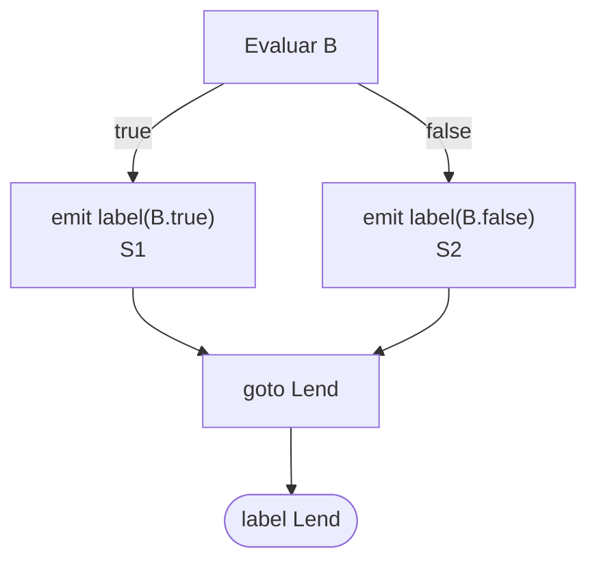

# Generación de TAC para Expresiones en Compiscript

Este documento describió el diseño de **generación de Código de Tres Direcciones (TAC, Three-Address Code)** para **expresiones** del lenguaje Compiscript. Se explicó cómo se tradujo cada categoría de expresión al 3AC textual y a cuádruplos, cómo se administraron **temporales** y **etiquetas**, y por qué se eligieron dichas decisiones.

## 1. Alcance y convenciones

Se generó TAC en **dos representaciones**:

- **3AC textual**: archivo `.tac` con instrucciones lineales y etiquetas (`Lk:`).
- **Cuádruplos**: tuplas en memoria `(op, arg1, arg2, res)` para testing y futuras optimizaciones.

Se definió que cada visita de expresión devolviera un registro `ExprRes = { type, place, is_temp }`, donde `place ∈ { Id, Const, t_i }`. Las instrucciones se **emitieron in situ** mediante un `Emitter` compartido.

**Temporales.** Se modeló un **pool por tipo** para reciclaje: `newtemp(T)` obtenía o creaba un temporal; la **liberación** se realizó en **post-orden** al emitir la operación del padre, salvo que el valor subiera como `place` de la expresión padre. Se reinicializó el pool al final de cada **sentencia**.

**Etiquetas.** Se utilizaron etiquetas simbólicas `Lk` para condiciones y control de flujo (corto-circuito), evitando temporales booleanos innecesarios.

**Razonamiento de diseño.** Cuádruplos y 3AC textual facilitaron trazabilidad y pruebas; el reciclaje local de temporales redujo presión de registros sin exigir análisis de vida global en esta etapa. El uso de etiquetas para booleanos consolidó las reglas de *short-circuit* recomendadas en diseños tipo DDS.

## 2. Operaciones aritméticas: `+`, `-`, `*`, `/`

### Traducción

Se tradujo una operación binaria `E = E1 op E2` como:

1. `L <- visit(E1)`, `R <- visit(E2)`
2. `T <- newtemp(type(E1 op E2))`
3. `emit(T = L.place op R.place)`
4. Liberación de `L` y `R` si fueron temporales
5. Devolución de `ExprRes{ type, T, True }`

Para unaria `-E`:

1. `X <- visit(E)`
2. `T <- newtemp(type(-, E))`
3. `emit(T = - X.place)`
4. Liberación de `X` si temporal
5. Devolución de `ExprRes{ type, T, True }`

### Ejemplo

Código fuente:

```c
z = (a + b) * (c - d);
```

3AC resultante:

```bash
t1 = a + b
t2 = c - d
t3 = t1 * t2
z  = t3
```

**Justificación.** Se separó en temporales para mantener tres direcciones por instrucción y permitir reciclaje local; el tipo del resultado se obtuvo con las reglas de `type_system.py` (p. ej., promoción numérica).

## 3. Operaciones lógicas: `&&`, `||`, `!`

Se implementó **corto-circuito** mediante etiquetas, sin materializar temporales booleanos salvo que el contexto exigiera un valor (p. ej., asignación de `bool`). Para `!E` se generó una evaluación directa mediante inversión de saltos o mediante asignación a `0/1` cuando se requirió como valor.

### Traducción (esquemas)

- `B -> B1 || B2`

  ```bash
  B1.true = B.true
  B1.false = Lmid
  B2.true = B.true
  B2.false = B.false
  B.code = B1.code || (Lmid:) || B2.code
  ```

- `B -> B1 && B2`

  ```bash
  B1.true = Lmid
  B1.false = B.false
  B2.true = B.true
  B2.false = B.false
  B.code = B1.code || (Lmid:) || B2.code
  ```

- `B -> E1 rel E2`

  ```bash
  if E1 rel E2 goto B.true
  goto B.false
  ```

### Diagrama – patrón `if (B) S1 else S2`



### Ejemplo

Código fuente:

```c
if (x < 100 || x > 200 && x != y) x = 0;
```

3AC resultante:

```bash
if x < 100 goto Lthen
ifFalse x > 200 goto Lend
ifFalse x != y goto Lend
Lthen: x = 0
Lend:
```

**Justificación.** El uso de etiquetas evitó temporales booleanos y respetó la semántica de **corto-circuito**; cuando la expresión lógica se utilizó como valor, se generó `t = 0/1` con saltos de relleno. Este patrón se derivó de reglas canónicas DDS (Aho et al., cap. 6; `docs/README_TAC_GENERATION.md`).

## 4. Comparaciones: `==`, `!=`, `<`, `<=`, `>`, `>=`

Se distinguieron dos contextos:

- **Contexto de control** (en condicionales y bucles):

  ```bash
  if E1 rel E2 goto Ltrue
  goto Lfalse
  ```

- **Contexto de valor** (asignación a un `bool`):

  ```bash
  t = (E1 rel E2)   ; t ∈ {0,1}
  ```

**Ejemplo (valor):**

```c
b = (a < c);
```

```bash
t1 = a < c
b  = t1
```

**Justificación.** Esta separación minimizó instrucciones y mantuvo expresividad: saltos en control; 0/1 cuando fue estrictamente necesario (Aho et al., cap. 6).

## 5. Asignaciones: `x = expr`

Se tradujo como:

1. `R <- visit(expr)`
2. `emit(x = R.place)`
3. Liberación de `R` si temporal

**Ejemplo:**

```c
x = a + b;
```

```bash
t1 = a + b
x  = t1
```

**Justificación.** Se preservó la forma 3AC canónica y se permitió al back-end aplicar copia/coalescencia si procede.

## 6. Inicialización de constantes (`const`)

Se exigió inicializador semánticamente. En TAC se emitió una única asignación al **símbolo constante** en su punto de declaración:

```c
const k: int = a + 1;
```

```bash
t1 = a + 1
k  = t1
```

**Justificación.** La semántica ya aseguró inmutabilidad; el TAC necesitó solamente materializar el valor. No se emitieron guardas adicionales en esta fase (véase `src/semantic/analyzers/statements.py` y `docs/README_TAC_GENERATION.md`).

## 7. Indexadas y listas: `x = a[i]`, `a[i] = x`

Se definieron instrucciones indexadas 3AC:

- **Lectura indexada:**

  ```bash
  t1 = a[i]
  x  = t1
  ```

- **Escritura indexada:**

  ```bash
  a[i] = x
  ```

**Ejemplo:**

```c
x = v[i + 1];
v[j] = x * 2;
```

```bash
t1 = i + 1
t2 = v[t1]
x  = t2
t3 = x * 2
v[j] = t3
```

**Justificación.** Se mantuvo la forma abstracta `a[i]` sin expandir a aritmética de direcciones, ya que el modelo de 3AC puede delegar dicha expansión al back-end. Las validaciones semánticas de rango estático por literales (si existieron) no alteraron la traducción (véase `src/semantic/analyzers/lvalues.py` y `expressions.py`).

## 8. Acceso a propiedades: `obj.f`, `obj.f = v`

Se trató `obj.f` como un **l-value** con desplazamiento calculado por `field_offsets`. En 3AC se mantuvo el acceso abstracto:

- **Lectura:**

  ```bash
  t1 = obj.f
  x  = t1
  ```

- **Escritura:**

  ```bash
  obj.f = v
  ```

**Ejemplo:**

```c
y = p.x + 1;
p.x = y;
```

```bash
t1 = p.x
t2 = t1 + 1
y  = t2
p.x = y
```

**Justificación.** El detalle de offset de campo se resolvió en la tabla de símbolos/clase (`field_offsets`). Se preservó la abstracción en 3AC para no acoplar el IR a un layout concreto; el back-end podrá expandir a direccionamiento base+desplazamiento.

## 9. Uso de `this` en métodos

Se modeló `this` como **parámetro implícito** de métodos, consistente con la semántica de `src/semantic/analyzers/classes.py` y con el registro de métodos (`registry/method_registry.py`). En TAC, `this` se comportó como un identificador disponible en el marco de activación del método:

```c
this.x = this.x + 1;
```

```bash
t1   = this.x
t2   = t1 + 1
this.x = t2
```

**Justificación.** Este enfoque alineó llamadas de método con la convención `param this; param arg1; ...; call Class.method, n`, simplificando resolución y RA.

## 10. Conversión / cast (si aplica)

La gramática de Compiscript no definió un operador explícito de *cast*; sin perjuicio de ello, se previó una política de **promoción implícita segura** cuando las reglas de tipos lo exigieron (p. ej., `int + float -> float`). En caso de requerirse materialización, se acordó utilizar pseudo-operaciones de conversión, por ejemplo:

- **Ampliación numérica:**

  ```bash
  t = i2f x
  ```

- **Conversión a booleano (cuando fue necesario producir un valor 0/1):**

  ```bash
  t = (E1 rel E2)
  ```

**Justificación.** Se evitó introducir *casts* arbitrarios sin soporte en la gramática y se limitó la conversión a lo necesario por las reglas de tipos (`src/semantic/type_system.py`). Cualquier conversión no segura quedaría rechazada en semántica.

## 11. Pseudocódigo de esquemas de traducción

### 11.1 Binaria aritmética

```text
function visitBinary(E1, op, E2):
    L = visit(E1)
    R = visit(E2)
    T = newtemp(resultType(E1, op, E2))
    emit(T = L.place op R.place)
    freeIfTemp(L); freeIfTemp(R)
    return { type: T.type, place: T, is_temp: true }
```

### 11.2 Relacional en contexto de control

```text
function emitRelCond(E1, rel, E2, Ltrue, Lfalse):
    L = visit(E1); R = visit(E2)
    emit(if L.place rel R.place goto Ltrue)
    emit(goto Lfalse)
    freeIfTemp(L); freeIfTemp(R)
```

### 11.3 Corto-circuito `||`

```text
function visitOr(B1, B2, Ltrue, Lfalse):
    Lmid = newlabel()
    visitCond(B1, Ltrue, Lmid)
    emitLabel(Lmid)
    visitCond(B2, Ltrue, Lfalse)
```

**Referencias:** `docs/README_TAC_GENERATION.md`, Aho, Sethi, Ullman (cap. 6–7).

## 12. Ejemplos integrados

### 12.1 Combinación aritmética y acceso a propiedad

```c
q = (p.x + a[i]) / 2;
```

```bash
t1 = p.x
t2 = a[i]
t3 = t1 + t2
t4 = t3 / 2
q  = t4
```

### 12.2 Lógica con corto-circuito y asignación

```c
b = (x < 0) || (x > 10 && y != 0);
```

Como valor booleano (0/1) se materializó mediante saltos y relleno:

```bash
# versión compacta: evaluar a 0/1
tB = 0
if x < 0 goto Ltrue
ifFalse x > 10 goto Lend
ifFalse y != 0 goto Lend
Ltrue: tB = 1
Lend:
b = tB
```

**Justificación.** Se respetó el corto-circuito y se produjo un único temporal booleano cuando la expresión se asignó a una variable.

## 13. Consideraciones de validación estática

Las validaciones semánticas (tipos compatibles, índice entero, rango estático cuando el literal de arreglo lo permitió, acceso a propiedad válido, uso legal de `this`) se ejecutaron en `src/semantic/`. Dichas validaciones no alteraron el patrón de TAC salvo para prevenir su emisión en presencia de errores (registro de diagnóstico y recuperación cuando fue posible).
