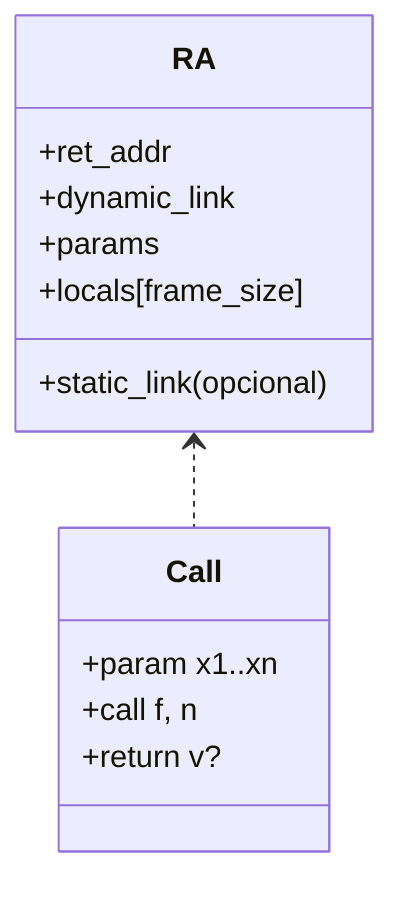

# Generación de TAC para Funciones y Procedimientos en Compiscript

Este documento describió el diseño de **generación de Código de Tres Direcciones (TAC, Three-Address Code)** para **funciones y procedimientos** en Compiscript. Se explicó cómo se tradujeron **declaraciones/definiciones**, **llamadas**, **retornos**, **recursión y funciones anidadas (closures)**, **parámetros/locales**, y el **modelo de registros de activación (RA)** en 3AC textual y en cuádruplos.

## 1. Convenciones de IR y objetivos

- Se generó TAC en dos vistas:

  - **3AC textual**: archivo `.tac` con etiquetas simbólicas `Lk:`.
  - **Cuádruplos**: `(op, arg1, arg2, res)` en memoria para pruebas y optimización.

- Cada visita de expresión devolvió `ExprRes = { type, place, is_temp }`, y los **efectos** se emitieron in situ vía un `Emitter`.
- Se modeló un **pool de temporales por función** (virtual registers). Dentro de cada función se recicló **por sentencia** para limitar la vida de temporales.
- Se fijó el protocolo de llamada 3AC: `param`, `call f, n`, asignación opcional del resultado y `return` en el callee. Para RA se emitió `enter f, local_frame_size`; `leave` se dejó como pseudo-op opcional (véase §7).

**Justificación.** Estas convenciones mantuvieron el IR simple y portable, aislaron el uso de temporales entre funciones y facilitaron la instrumentación del RA de forma independiente de la máquina objetivo (`docs/README_TAC_GENERATION.md`).

## 2. Declaración y definición de funciones

### 2.1 Símbolos y metadatos

Se extendió el símbolo de función con:

- `label` de entrada (`f_<nombre>` o `f_<Clase>_<método>`).
- `param_types` y `return_type` (desde semántica).
- `local_frame_size` (capturado al cerrar el scope vía `ScopeManager.frameSize()`).
- `captures_layout` cuando existieron closures (orden y tipos de capturas).

**Justificación.** Estos metadatos permitieron etiquetar el punto de entrada para `call`, determinar el tamaño del RA, y comprobar llamadas/retornos en semántica antes de emitir TAC.

### 2.2 Emisión TAC de una definición

Se emitió el patrón:

```bash
f_<name>:
enter f_<name>, <local_frame_size>
; cuerpo traducido a TAC
; (opcional) leave f_<name>
; retorno(s) mediante 'return' dentro del cuerpo
```

- Se aceptaron múltiples `return` internos (véase §7).
- Si la función fue `void`, no se exigió `return` explícito al final.

**Justificación.** `enter` explicitó el tamaño del marco local; `return` condujo el epílogo lógico. Se evitó un saltadero final artificial salvo necesidad del backend.

## 3. Llamadas a funciones: argumentos por posición y tipos

### 3.1 Convención de llamada

- **Orden de evaluación de argumentos**: izquierda a derecha.
- **Paso de argumentos**: `param arg_i` por cada argumento materializado.
- **Invocación**:

  - Sin valor de retorno: `call f_label, n`.
  - Con valor de retorno: `t = call f_label, n` donde `t = newtemp(return_type)`.

### 3.2 Tipos y verificación

- La verificación de **número y tipos** de argumentos contra `param_types` se realizó en semántica (`functions.py`, `lvalues.py`).
- El IR asumió llamadas bien tipadas; no se insertaron conversiones implícitas adicionales salvo las requeridas por `type_system.py`.

**Ejemplo:**

```c
function add(a: int, b: int): int { return a + b; }
x = add(u + 1, v);
```

3AC:

```bash
f_add:
enter f_add, <frame>
t1 = a + b
return t1

t2 = u + 1
param t2
param v
t3 = call f_add, 2
x  = t3
```

**Justificación.** Se separó evaluación de argumentos y su paso por `param` para mantener claridad 3AC y facilitar optimizaciones.

## 4. Retornos de funciones y validación de tipos

### 4.1 Emisión de `return`

- **Con valor**:

  ```bash
  R = visit(expr)
  return R.place
  ```

- **Sin valor (`void`)**:

  ```bash
  return
  ```

`returns.py` garantizó que cada camino de ejecución en funciones no-`void` alcanzara un `return` tipado correctamente y marcó terminación de flujo para diagnóstico de código inalcanzable (`statements.py`).

**Ejemplo:**

```c
function max(a: int, b: int): int {
  if (a > b) return a;
  return b;
}
```

3AC:

```bash
f_max:
enter f_max, <frame>
if a > b goto LretA
goto LretB
LretA:
    return a
LretB:
    return b
```

**Justificación.** El uso de retornos directos evitó epílogos redundantes y mantuvo el IR fiel a la estructura de control.

## 5. Recursión y funciones anidadas (closures)

### 5.1 Recursión

Las funciones se llamaron a sí mismas por su `label`; no se requirió manejo especial en TAC.

**Ejemplo (factorial):**

```c
function fact(n: int): int {
  if (n <= 1) return 1;
  return n * fact(n - 1);
}
```

3AC:

```bash
f_fact:
enter f_fact, <frame>
if n <= 1 goto Lbase
goto Lrec
Lbase:
    return 1
Lrec:
    t1 = n - 1
    param t1
    t2 = call f_fact, 1
    t3 = n * t2
    return t3
```

### 5.2 Funciones anidadas y closures (si aplica)

Cuando se devolvió o almacenó una función interna, se materializó una **closure**:

- Construcción del **entorno (env)** a partir de `captures_layout`.
- Creación de la **closure**:

  ```bash
  envX   = mkenv(...capturas...)
  fval   = mkclos f_inner_label, envX
  ```

- Llamada a closure:

  ```bash
  ; callc extrae f_label y pasa 'env' como primer parámetro oculto
  t = callc fval, n
  ```

**Justificación.** Este patrón explicitó la semántica de entorno sin imponer un layout concreto. La separación `mkclos`/`callc` permitió instrumentar *static link* en el backend si fuera necesario (`docs/README_TAC_GENERATION.md`).

## 6. Manejo de parámetros y variables locales

- **Parámetros**: se asumieron **por valor**; clase de almacenamiento `param`.
- **Locales**: offsets en el marco local (`stack`). Referencias inicializadas a `null` según política semántica; tipos valor conforme a `type_system.py`.
- **Direcciones**: `storage ∈ {global, stack, param}` y `offset`/`frame_index` en `symbol_table.py` para resolver `place` en TAC de forma abstracta.

**Justificación.** Esta separación unificó convención de llamada y asignación de offsets calculada por `ScopeManager`, dejando al backend la materialización base+desplazamiento.

## 7. Registros de activación y pila de llamadas

### 7.1 Modelo de RA (independiente de máquina)

Se adoptó un modelo lógico:

```bash
[ ret_addr | dynamic_link | static_link? | params | locals (frame_size) ]
```

- **Protocolo TAC**:

  - Prólogo: `enter f_label, local_frame_size`
  - Epílogo: `return [place]`
  - `leave f_label` se consideró opcional; en este diseño, `return` implicó el epílogo.

**Diagrama:**



**Justificación.** `enter` fijó el tamaño del marco local según `ScopeManager.frameSize()`. `return` modeló la restauración del enlace dinámico y la transferencia al `ret_addr`. Se mantuvo la fase intermedia desacoplada de detalles de plataforma (`docs/README_TAC_GENERATION.md`).

## 8. Aislamiento de temporales y pools de "registros" virtuales

- Se definió un **pool de temporales por función**. Al entrar a una función, se inicializó el pool; al salir, se descartó.
- Dentro de una función, se recicló **por sentencia** (post-orden) para minimizar vidas superpuestas.
- Se evitó reuso de **identificadores de temporales** entre funciones distintas (espacio de nombres por función), garantizando que `t1` del callee no colisionara con `t1` del caller.
- En el **caller**, los temporales vivos antes de `param...call` continuaron válidos tras la llamada; el **callee** operó con su pool independiente.

**Justificación.** Este aislamiento previno efectos colaterales entre funciones y simplificó la depuración del IR, cumpliendo el requisito de "evitar efectos colaterales sobre temporales de otras funciones".

## 9. Pseudocódigo de emisión

### 9.1 Definición de función

```text
function emitFunctionDef(sym_f, body):
    emitLabel(sym_f.label)
    emit( enter sym_f.label, sym_f.local_frame_size )
    initTempPool()                   ; pool por función
    emitBlock(body)                  ; genera 'return' donde aplique
    ; opcional: emit( leave sym_f.label )
    destroyTempPool()
```

### 9.2 Llamada

```text
function emitCall(f_label, args, hasRet, retType):
    for arg in args (left-to-right):
        A = visit(arg)
        emit( param A.place )
        freeIfTemp(A)                ; reciclaje por sentencia
    if hasRet:
        T = newtemp(retType)
        emit( T = call f_label, len(args) )
        return T
    else:
        emit( call f_label, len(args) )
        return None
```

### 9.3 Return

```text
function emitReturn(optExpr):
    if optExpr exists:
        R = visit(optExpr)
        emit( return R.place )
        freeIfTemp(R)
    else:
        emit( return )
```

### 9.4 Closure (si aplica)

```text
function emitClosureMake(inner_label, captures):
    ENV = mkenv(captures...)          ; layout según captures_layout
    C   = mkclos(inner_label, ENV)
    return C

function emitClosureCall(C, args, hasRet, retType):
    for arg in args:
        A = visit(arg); emit( param A.place ); freeIfTemp(A)
    if hasRet:
        T = newtemp(retType)
        emit( T = callc C, len(args) )
        return T
    else:
        emit( callc C, len(args) )
```

## 10. Ejemplos

### 10.1 Función con locales y retorno

```c
function inc(x: int): int {
  let y: int = x + 1;
  return y;
}
z = inc(a);
```

3AC:

```bash
f_inc:
enter f_inc, <frame>
t1 = x + 1
y  = t1
return y

param a
t2 = call f_inc, 1
z  = t2
```

### 10.2 Función `void` con múltiples retornos

```c
function logPos(x: int): void {
  if (x <= 0) return;
  print(x);
}
```

3AC:

```bash
f_logPos:
enter f_logPos, <frame>
if x <= 0 goto Lret
param x
call f_print, 1
return
Lret:
return
```

### 10.3 Función anidada (closure) que captura una variable

```c
function makeAdder(n: int) {
  function add(x: int): int { return x + n; }
  return add;
}
y = makeAdder(5)(3);
```

3AC (esqueleto):

```bash
f_add:
enter f_add, <frame_inner>
t1 = x + env.n
return t1

f_makeAdder:
enter f_makeAdder, <frame_outer>
ENV1 = mkenv(n)
addC = mkclos f_add, ENV1
return addC

param 5
t2 = call f_makeAdder, 1
param 3
t3 = callc t2, 1
y  = t3
```
