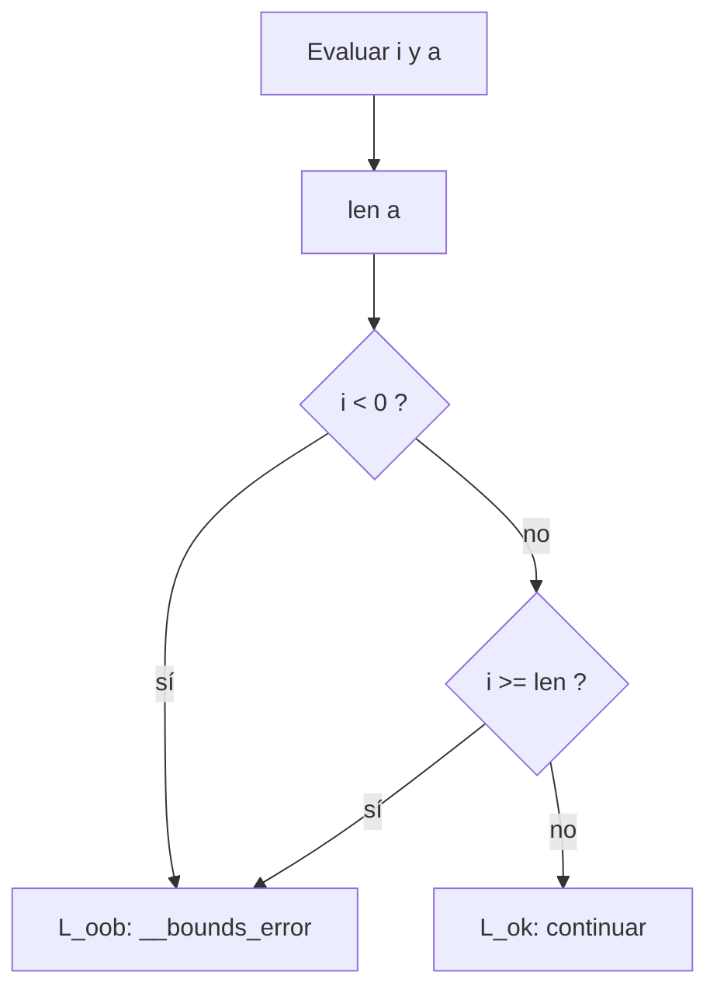

# Generación de TAC para Listas y Estructuras de Datos en Compiscript

Este documento describió el diseño de **generación de Código de Tres Direcciones (TAC, Three-Address Code)** para **listas** y **estructuras de datos** (incluyendo campos de objetos que contienen listas) en Compiscript. Se explicó cómo se tradujeron las operaciones de **acceso**, **asignación**, **construcción** y **validaciones** a 3AC textual y a cuádruplos, cómo se administraron **temporales** y cómo se justificaron las decisiones de diseño.

## 1. Modelo y convenciones de IR

- Se usó **3AC textual** (archivo `.tac` con etiquetas `Lk:`) y **cuádruplos** `(op, arg1, arg2, res)` en memoria.
- Cada visita de expresión devolvió `ExprRes = { type, place, is_temp }`. La emisión se realizó **in situ** mediante un `Emitter`.
- Se modeló un **pool de temporales por función**, con reciclaje **por sentencia** (post-orden) para minimizar vidas superpuestas de temporales (véase también el documento de expresiones y `docs/README_TAC_GENERATION.md`).
- Se representaron operaciones de listas de forma **abstracta** en TAC:

  - Lectura indexada: `t = a[i]`
  - Escritura indexada: `a[i] = v`
  - Longitud: `t_len = len a` (pseudo-operación abstracta)
  - Construcción de literal: `t = newlist n` seguido de asignaciones `t[k] = v_k`

**Justificación.** Mantener operaciones de listas en un nivel abstracto permitió desacoplar el IR del layout físico (cabecera con longitud, región de datos, etc.) y dejó al backend la materialización en memoria (heap, desplazamientos, representación de longitud), sin modificar la fase TAC.

## 2. Verificación de tipo de elementos en listas y estructuras

La verificación de homogeneidad de literales de lista y la comprobación de tipos de elementos se realizó **en semántica**:

- `validators/literal.py` tipó literales (`[1,2,3]`, `["a","b"]`, etc.).
- `type_system.py` y `custom_types.py` definieron `ArrayType(elemType)` y su compatibilidad.
- `expressions.py` y `lvalues.py` validaron que la **asignación** a `a[i]` fuese compatible con el **tipo de elemento**.

**Efecto en TAC.** El generador asumió entradas **bien tipadas**. Por ello:

- No se emitieron conversiones implícitas adicionales en TAC (salvo las necesarias por reglas de promoción numérica ya definidas).
- La existencia de `ArrayType(T)` determinó el tipo de temporales usados al leer `a[i]` y al preparar argumentos en escrituras `a[i] = expr`.

**Justificación.** Separar la **validación de tipos** en semántica simplificó el IR y evitó `guards` redundantes en TAC; el 3AC permaneció compacto y verificable con las firmas de tipos del árbol anotado (véase `docs/README_TAC_GENERATION.md`).

## 3. Validación de índices en accesos y asignaciones

### 3.1 Índice entero

La semántica exigió que el índice fuese de tipo entero (véase los tests `error_index_no_entero.cps` / `success_index_entero.cps`). El TAC no introdujo conversiones de tipo para el índice.

### 3.2 Seguridad de límites (bounds checking)

Se implementó una verificación **en TAC** basada en longitud observable:

- Se introdujo la pseudo-operación `t_len = len a`.
- Se generaron comparaciones y saltos:

  ```bash
  if i < 0 goto L_oob
  if i >= t_len goto L_oob
  goto L_ok
  L_oob: call __bounds_error, 0   ; o emisión de diagnóstico según runtime
  L_ok:  ; continuar con la operación
  ```

**Justificación.** El TAC mantuvo un nivel de seguridad uniforme, incluso cuando la longitud no fuese conocida estáticamente. Este esquema permitió al backend instrumentar o eliminar `bounds checks` según modo de construcción (por ejemplo, "release" vs. "debug"), sin cambiar la lógica del emisor (véase `docs/README_TAC_GENERATION.md`).

**Diagrama — Validación de índice:**



## 4. Traducción de operaciones de acceso y asignación a TAC

### 4.1 Lectura: `x = a[i]`

**Esquema:**

```bash
I  = visit(i)
A  = visit(a)
L  = newlabel() ; L_ok
E  = newlabel() ; L_oob
tL = newtemp(int)
tV = newtemp(elemType(a))

tL = len A.place
if I.place < 0 goto E
if I.place >= tL goto E
goto L
E:  call __bounds_error, 0
L:  tV = A.place[I.place]
x  = tV

freeIfTemp(I); freeIfTemp(A); freeIfTemp(tL); freeIfTemp(tV)
```

**Justificación.** Se separó la verificación de límites de la operación de carga, preservando claridad y posibilitando optimización posterior (p. ej., eliminación de checks redundantes en bucles).

### 4.2 Escritura: `a[i] = expr`

**Esquema:**

```bash
I  = visit(i)
A  = visit(a)
V  = visit(expr)
tL = newtemp(int)

tL = len A.place
if I.place < 0 goto E
if I.place >= tL goto E
goto L
E:  call __bounds_error, 0
L:  A.place[I.place] = V.place

freeIfTemp(I); freeIfTemp(A); freeIfTemp(V); freeIfTemp(tL)
```

**Justificación.** La simetría entre lectura y escritura simplificó el emisor y mantuvo la consistencia de tipos (garantizada por semántica).

### 4.3 Acceso mixto: `struct.field[i]` / `obj.f[i]`

Se descompuso en **dos pasos**: (1) acceso a propiedad, (2) indexación.

```bash
O  = visit(struct)        ; u obj
tF = newtemp(listType)    ; tipo del campo 'f'
tF = O.place.f
; validar índice como en §4.1
tL = newtemp(int)
tL = len tF
if I.place < 0 goto E
if I.place >= tL goto E
goto L
E:  call __bounds_error, 0
L:  tV = tF[I.place]
x  = tV
```

**Justificación.** Mantener `obj.f` como carga abstracta y luego aplicar indexación evitó duplicar reglas y facilitó composición con el diseño de **clases y objetos**.

## 5. Reglas de generación para lectura y escritura de elementos

### 5.1 Lecturas encadenadas: `a[i][j]`

Se aplicó recursivamente el esquema de §4.1:

```bash
tI = visit(i)
tA = visit(a)
tL = len tA
check tI in [0, tL)
tA1 = tA[tI]           ; tA1 es una lista (elementType = ArrayType(...))

tJ = visit(j)
tL2 = len tA1
check tJ in [0, tL2)
tV = tA1[tJ]
x  = tV
```

### 5.2 Escrituras encadenadas: `a[i][j] = v`

Misma idea, con el último paso como **almacenamiento**:

```bash
... ; obtener tA1 como arriba
... ; chequear j con tL2
tV = visit(v)
tA1[tJ] = tV
```

**Justificación.** La aplicación recursiva mantuvo un diseño uniforme y modulable, y permitió la eliminación de checks redundantes en optimizaciones posteriores si el emisor reconoce invariantes de bucle.

## 6. Construcción de literales de lista

Para un literal `[e1, e2, ..., en]` se emitió:

```bash
t  = newlist n
p1 = visit(e1)
t[0] = p1
...
pk = visit(ek)
t[k-1] = pk
; el valor del literal es t
```

**Reglas:**

- Las expresiones `ek` se evaluaron **izq->der**, liberando temporales después de `parametrizar` cada almacenamiento.
- La **homogeneidad** del literal se garantizó en semántica; el **tipo** del literal quedó como `ArrayType(T)`.

**Justificación.** Esta estrategia produjo TAC compacto y con un número acotado de temporales vivos, coherente con el pool por sentencia.

## 7. Manejo de memoria y dirección efectiva (abstracto)

El TAC mantuvo operaciones abstractas:

- `newlist n` -> referencia a bloque con cabecera `len` y región de datos.
- `len a` -> obtiene longitud (desde cabecera).
- `a[i]` / `a[i] = v` -> carga/almacén indexado.

El backend materializó:

- Desplazamientos `base + (i * elemSize)` con `elemSize` derivado de `type_system.py`.
- Ancho y alineación se obtuvieron de `custom_types.py`/`type_system.py`.

**Justificación.** El desacoplamiento permitió cambios en representación (por ejemplo, *small vector optimization* o compresión de booleanos) sin tocar la fase intermedia.

## 8. Gestión de temporales y pools

- Se mantuvo un **pool por función** (o método).
- En cada operación de lista, se crearon temporales para:

  - Índices (`tI`, `tJ`), longitud (`tL`, `tL2`), valores (`tV`), campos (`tF`).
- Se reciclaron en **post-orden por sentencia**:

  - Tras `emit(tV = a[i])`, si `tI` y `a` fueron temporales y no subieron como `place`, se devolvieron al pool.
  - Tras `emit(a[i] = v)`, se liberaron `tI`, `a`, `v` cuando aplicó.
- No se reutilizaron **identificadores de temporales** entre funciones (espacio de nombres por función), evitando colisiones con el callee.

**Justificación.** Este esquema mantuvo bajo el número de temporales en vivo, facilitó depuración y cumplió el requisito de evitar efectos colaterales entre funciones (véase `docs/README_TAC_GENERATION.md`).

## 9. Pseudocódigo de emisión

### 9.1 Lectura `x = a[i]`

```text
function emitLoadIndex(aExpr, iExpr, outVar):
    A  = visit(aExpr)
    I  = visit(iExpr)
    TL = newtemp(int)
    TL = len A.place
    emit( if I.place < 0 goto L_oob )
    emit( if I.place >= TL goto L_oob )
    emit( goto L_ok )
    emitLabel(L_oob)
    emit( call __bounds_error, 0 )
    emitLabel(L_ok)
    TV = newtemp(elemTypeOf(A.type))
    emit( TV = A.place[I.place] )
    emit( outVar = TV )
    freeIfTemp(A); freeIfTemp(I); freeIfTemp(TL); freeIfTemp(TV)
```

### 9.2 Escritura `a[i] = v`

```text
function emitStoreIndex(aExpr, iExpr, vExpr):
    A  = visit(aExpr)
    I  = visit(iExpr)
    V  = visit(vExpr)
    TL = newtemp(int)
    TL = len A.place
    emit( if I.place < 0 goto L_oob )
    emit( if I.place >= TL goto L_oob )
    emit( goto L_ok )
    emitLabel(L_oob)
    emit( call __bounds_error, 0 )
    emitLabel(L_ok)
    emit( A.place[I.place] = V.place )
    freeIfTemp(A); freeIfTemp(I); freeIfTemp(V); freeIfTemp(TL)
```

### 9.3 Literal de lista `[e1, ..., en]`

```text
function emitListLiteral(elems):
    T  = newtemp(ArrayType(typeOfElems(elems)))
    emit( T = newlist len(elems) )
    for k, ek in enumerate(elems):
        P = visit(ek)
        emit( T[k] = P.place )
        freeIfTemp(P)
    return T
```

### 9.4 Acceso mixto `obj.f[i]`

```text
function emitFieldIndex(objExpr, field, iExpr, outVar):
    O  = visit(objExpr)
    TF = newtemp(typeOfField(O.type, field))
    emit( TF = O.place.field )
    emitLoadIndex(TF, iExpr, outVar)  ; reutiliza la lógica de lectura indexada
    freeIfTemp(O); freeIfTemp(TF)
```

## 10. Ejemplos integrados

### 10.1 Lectura y escritura simples

Código:

```c
let a = [10, 20, 30];
x = a[1];
a[2] = x + 5;
```

3AC:

```bash
t0 = newlist 3
t0[0] = 10
t0[1] = 20
t0[2] = 30
a = t0

tL = len a
if 1 < 0 goto L_oob1
if 1 >= tL goto L_oob1
goto L_ok1
L_oob1: call __bounds_error, 0
L_ok1:  t1 = a[1]
x = t1

t2 = x + 5
tL2 = len a
if 2 < 0 goto L_oob2
if 2 >= tL2 goto L_oob2
goto L_ok2
L_oob2: call __bounds_error, 0
L_ok2:  a[2] = t2
```

### 10.2 Acceso mixto con campo lista

Código:

```c
p.values[0] = p.values[0] + 1;
```

3AC:

```bash
tF1 = p.values
tL1 = len tF1
if 0 < 0 goto L_oobA
if 0 >= tL1 goto L_oobA
goto L_okA
L_oobA: call __bounds_error, 0
L_okA:  tV1 = tF1[0]

t3  = tV1 + 1

tF2 = p.values
tL2 = len tF2
if 0 < 0 goto L_oobB
if 0 >= tL2 goto L_oobB
goto L_okB
L_oobB: call __bounds_error, 0
L_okB:  tF2[0] = t3
```

### 10.3 Doble indexación

Código:

```c
x = m[i][j];
```

3AC:

```bash
tLm = len m
if i < 0 goto L_oob1
if i >= tLm goto L_oob1
goto L_ok1
L_oob1: call __bounds_error, 0
L_ok1:  tRow = m[i]

tLr = len tRow
if j < 0 goto L_oob2
if j >= tLr goto L_oob2
goto L_ok2
L_oob2: call __bounds_error, 0
L_ok2:  tVal = tRow[j]
x = tVal
```

## 11. Justificación de decisiones de diseño

1. **Abstracción de listas en TAC.** Se modelaron operaciones `newlist`, `len`, `a[i]` y `a[i] = v` para desacoplar la IR del detalle de memoria; esto permitió cambiar el layout (cabecera, alineación, tamaños) sin reescribir la fase intermedia.

2. **Validaciones en semántica.** La homogeneidad de literales y el tipo `int` del índice se aseguraron antes de TAC, reduciendo la complejidad del IR y evitando comprobaciones redundantes (consistente con `src/test/arreglos/*`).

3. **Bounds checking en TAC.** Se generaron comparaciones y saltos explícitos alrededor de las operaciones indexadas, usando `len a` para obtener longitud. Esta medida mantuvo la **seguridad de índices** a nivel intermedio y facilitó optimizaciones (eliminación de checks redundantes en bucles).

4. **Pools de temporales.** Se reutilizaron temporales por sentencia y por función para reducir presión de registros y evitar efectos colaterales entre funciones (consistente con el diseño general de TAC documentado en `docs/README_TAC_GENERATION.md`).

5. **Composición con objetos.** Se descompuso `obj.f[i]` en `obj.f` seguido de indexación; esta composición mantuvo coherencia con el documento de **Clases y Objetos** y evitó reglas duplicadas.
