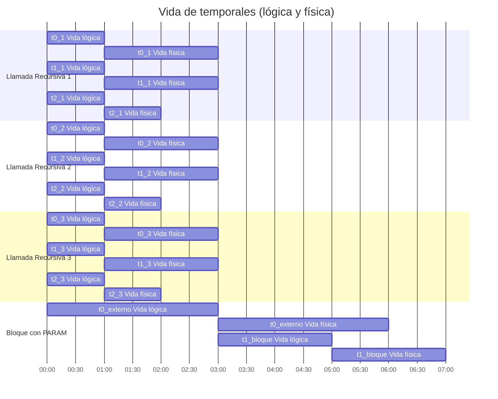

# Estándar de manejo de temporales en TAC

## 1. Concepto de temporal

- Un **temporal** es una variable interna usada para almacenar resultados intermedios en TAC.

- Cada temporal tiene:

  - **Vida lógica (nombre TAC):** duración del nombre en todo el programa (`t0`, `t1`, `t2`...). Este nombre **nunca se reinicia** y siempre sigue una **secuencia global** ascendente.
  - **Vida física (registro o slot de memoria):** duración del uso real en memoria o registro. Puede reciclarse después de que la vida lógica termine, **excepto en casos especiales** (`PARAM`, recursión profunda, bloques anidados con paso de parámetros).

- La vida física **no significa que el nombre TAC haya desaparecido**, solo que el registro puede ser reutilizado.

*Nota:* "Inmediata" significa "tras el último uso lógico", **no necesariamente inmediatamente después de la instrucción**.

## 2. Ciclo de vida lógico de un temporal

- Comienza **en el momento de la asignación**.
- Termina **después del último uso del valor** en cualquier operación dentro de la función.
- **Nunca se reutiliza un nombre TAC** mientras su valor pueda ser leído.

### Ejemplo

```text
t0 := a + b          ; vida lógica inicia t0
t1 := t0 * 2         ; último uso lógico de t0
t0 muere físicamente  ; registro disponible para otro temporal
```

- Si hay otra operación usando `t0` más abajo, la vida lógica se extiende hasta ese uso.

## 3. Vida física de temporales y casos especiales

- Normalmente, la vida física se libera **tras el último uso lógico**.
- Excepciones:

  1. **PARAM:** un temporal usado como argumento mantiene registro hasta completar `CALL`.
  2. **Recursión profunda:** cada llamada tiene su propio contexto físico; registros no se comparten entre llamadas.
  3. **Bloques anidados con temporales externos pasados como parámetros:** la vida física se extiende hasta finalizar el uso del argumento.

### Ejemplo de `PARAM`

```text
t1 := x             ; vida lógica inicia t1
PARAM t1            ; uso como argumento
CALL toString, 1     ; t1 físicamente sigue vivo hasta completar CALL
t1 muere físicamente ; registro disponible
```

## 4. Reasignación y sufijos decorativos

- Cada asignación inicia un **nuevo ciclo de vida lógico**.
- Los ciclos de vida **no deben superponerse** en la misma variable lógica.
- **Sufijos decorativos** (`t1_1`, `t1_2`) son **solo para depuración**; no alteran la secuencia TAC global (`t0, t1, t2...`).

```text
t1 := t0 + t2  ; vida lógica 1
...
t1 := t3 * t4  ; vida lógica 2, nombre TAC sigue secuencial globalmente
```

*Advertencia:* los sufijos ayudan a visualizar contextos físicos independientes (p. ej., recursión), pero **no cambian la numeración TAC real**.

## 5. Temporales en bloques y funciones

- Los temporales son **locales a la función**, no afectan otras funciones.
- Los nombres TAC son **globales y secuenciales**, asegurando unicidad.
- Dentro de bloques (`if`, `while`, `for`):

  - Los temporales creados en el bloque viven físicamente **solo mientras se usan**.
  - Si un temporal externo se reasigna dentro del bloque, **se genera un nuevo nombre TAC**.
  - Si un temporal externo se pasa como argumento a una función dentro del bloque, **su vida física se extiende hasta finalizar el uso**.

### Ejemplo de bloque con temporal externo como argumento

```text
t0 := a + b          ; temporal externo
IF cond GOTO BLOCK
BLOCK:
t1 := t0 * 2         ; vida física de t0 se extiende mientras t1 usa su valor
PARAM t0
CALL foo, 1          ; t0 físicamente sigue vivo hasta completar CALL
t0 muere físicamente  ; ahora sí se puede reciclar
```

## 6. Reglas de seguridad TAC

1. Nunca reutilizar un registro antes de que la vida lógica termine.
2. PARAM mantiene vida física hasta completar CALL.
3. Cada asignación inicia un ciclo de vida lógico independiente.
4. Nombres TAC **siempre secuenciales** y únicos globalmente.
5. Vida física y lógica se gestionan separadamente.
6. Recursión: cada llamada tiene contexto físico propio; numeración TAC global sigue incrementando.
7. Bloques anidados que pasan temporales como parámetros extienden la vida física del temporal externo.
8. Sufijos decorativos solo afectan depuración, **no la numeración TAC principal**.
9. Seguir estas reglas evita sobrescritura de registros aún vivos y conflictos de memoria.

*Nota:* Para compiladores con límite de registros, se deben gestionar colisiones mediante reubicación o spill a memoria.

## 7. Ejemplos consistentes de vida lógica

- Temporal usado en varias operaciones:

```text
t0 := a + b          ; inicio vida lógica t0
t1 := t0 * 2
t2 := t0 - 3         ; último uso lógico de t0
t0 muere físicamente
```

- Temporal pasado como parámetro:

```text
t3 := y
PARAM t3
CALL factorial, 1    ; t3 físicamente sigue vivo hasta terminar CALL
t3 muere físicamente
```

## 8. Ejemplo de recursión profunda

```text
; factorial(n)
t0 := n == 0          ; vida lógica t0
IF t0 > 0 GOTO base

t1 := n - 1           ; vida lógica t1
PARAM t1
CALL factorial, 1     ; t1 físicamente sigue vivo hasta terminar CALL

t2 := R               ; retorno
t3 := n * t2          ; vida lógica t3
RETURN t3             ; t0, t1, t2 mueren físicamente según último uso
```

*Observaciones:*

- Numeración TAC global: `t0, t1, t2, t3`.
- Cada llamada recursiva tiene **contexto físico independiente**.
- Stack visual de 3 llamadas:

```bash
Call 1: t0_1 | t1_1 | t2_1 | t3_1
Call 2: t0_2 | t1_2 | t2_2 | t3_2
Call 3: t0_3 | t1_3 | t2_3 | t3_3
```

## 9. Nombres TAC y secuencia global

- Siempre `t0, t1, t2,...` **incrementales**, sin reinicios.
- Reutilización física **no altera nombres TAC**.
- Numeración continúa entre funciones, bloques y llamadas recursivas.

```text
t0 := gp[24] <= 5
IF t0 > 0 GOTO WHILE_BODY

WHILE_BODY:
t1 := gp[24] % 2
t2 := t1 == 0
IF t2 > 0 GOTO IF_THEN
GOTO IF_ELSE

IF_THEN:
t3 := gp[24] * 2
gp[0] := t3
GOTO IF_END

IF_ELSE:
t4 := gp[24] + 1
gp[0] := t4

IF_END:
t5 := gp[24] + 10
gp[24] := t5
```

*Principios aplicados:*

1. Secuencia estricta: nombres TAC únicos y ascendentes.
2. Ciclos de vida individuales: nacimiento, uso, muerte física.
3. Reutilización interna de registros: segura y transparente al TAC lógico.

## 10. Diagramas sugeridos



## 11. Glosario y casos especiales

- **Vida lógica:** duración del nombre TAC en todo el programa.
- **Vida física:** duración del valor en registro/memoria.
- **Sufijo decorativo:** marca visual para depuración; no afecta numeración global.
- **PARAM:** temporal pasado como argumento; vida física extendida hasta completar CALL.
- **Recursión:** cada llamada crea un contexto físico independiente.
- **Bloque anidado:** temporal externo pasado como argumento extiende vida física hasta finalizar uso.
- **Error común:** sobrescribir registro antes de terminar la vida lógica → corrupción de valores.
